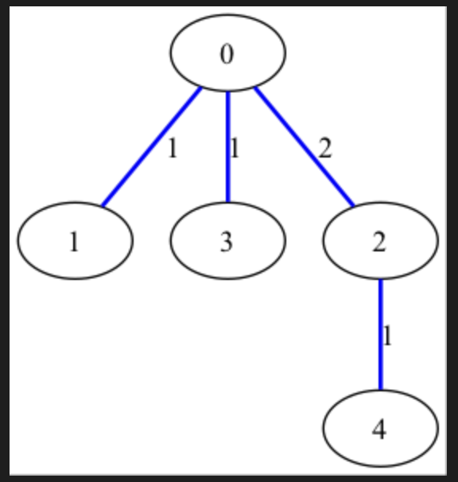

# Алгоритм Прима для построения минимального остовного дерева (MST)

## Что такое минимальное остовное дерево (MST)?

**Минимальное остовное дерево (Minimum Spanning Tree, MST)** — это подграф связного взвешенного неориентированного графа, который:
- Содержит все вершины исходного графа
- Не содержит циклов
- Имеет минимально возможную сумму весов рёбер

## Алгоритм Прима: логика и реализация

### Основная идея
Алгоритм Прима — это **жадный алгоритм**, который строит MST, начиная с произвольной вершины и последовательно добавляя к дереву ребро с минимальным весом, соединяющее дерево с новой вершиной.

---
## **Для чего нужен алгоритм Прима?**
### **Основные применения**
1. **Оптимизация сетевых структур**
    - Построение оптимальных дорожных/транспортных сетей (минимизация длины дорог).
    - Проектирование электрических сетей (разводка кабелей с минимальными затратами).
    - Оптимизация водопроводных, газовых и телекоммуникационных сетей.

2. **Кластерный анализ и машинное обучение**
    - Используется в алгоритмах кластеризации (например, для выделения групп похожих объектов).
    - Применяется в задачах сегментации изображений.

3. **Алгоритмы приближённого решения сложных задач**
    - В задаче коммивояжёра (TSP) MST используется для построения эвристических решений.
    - В алгоритмах поиска кратчайших путей (как вспомогательная структура).

4. **Компьютерная графика и геоинформационные системы (ГИС)**
    - Построение скелета 3D-моделей.
    - Оптимизация маршрутов на картах (например, для прокладки трубопроводов с минимальными затратами).

### **Примеры реального использования**
1. **Google Maps**
    - При построении оптимальных маршрутов для коммунальных служб (например, прокладка оптоволокна).

2. **Телекоммуникационные компании**
    - Для расчёта минимальной стоимости подключения вышек сотовой связи.

3. **Логистика и доставка**
    - Оптимизация маршрутов доставки товаров между складами.

4. **Биоинформатика**
    - Анализ генетических связей между организмами через MST.

---

# Описание алгоритма
## 1. Инициализация
- Выбор **произвольной стартовой вершины** (обычно берётся вершина 0)
- Создание **пустого множества для хранения вершин MST**
- Инициализация **приоритетной очереди (min-heap)** для хранения рёбер

### 2. Основной цикл (Детализация)
**Пошаговый процесс с объяснением:**

**Шаг 2.1:** Извлечение минимального ребра
- Извлекаем ребро с наименьшим весом из кучи

**Шаг 2.2:** Проверка на образование цикла
- Цикл образуется, если **обе вершины ребра уже в MST**
- Проверяем, что вершина `v` ещё не включена в MST


**Шаг 2.3:** Добавление в MST
- Добавляем вершину `v` в множество MST
- Фиксируем ребро как часть остовного дерева

**Шаг 2.4:** Добавление новых рёбер в кучу
- Добавляем только рёбра, ведущие **к вершинам вне MST**
- Это критически важно для предотвращения циклов!

## Пример использовани алгоритма
### Исходный граф

### Применили алгоритм Прима

## Характеристики алгоритма

### Сложность
| Структура данных | Временная сложность | Пространственная сложность |
|------------------|---------------------|----------------------------|
| Матрица смежности + массив | O(V²) | O(V) |
| Список смежности + бинарная куча | O(E log V) | O(V + E) |
| Список смежности + фибоначчиева куча | O(E + V log V) | O(V + E) |

### Сравнение с другими алгоритмами MST
| Критерий | Прим | Крускал | Борувки |
|----------|------|---------|---------|
| Сложность | O(E log V) | O(E log E) | O(E log V) |
| Лучший случай | Плотные графы | Разреженные графы | Параллельные вычисления |
| Используемые структуры | Куча | СНМ (DSU) | Множества компонент |

## Как запустить код

### 1. Установка зависимостей

```bash
# Для Ubuntu/Debian
sudo apt update && sudo apt install -y g++ cmake make graphviz

# Для macOS (с Homebrew)
brew update && brew install cmake graphviz gcc
```

### 2. Запуск программы

```bash
# Основной запуск
./prim

# С параметрами (пример)
./prim --vertices 10 --min-weight 1 --max-weight 10 --complete
```

### 3. Генерация визуализации

После выполнения программы будут созданы:
- `graph.dot` - описание исходного графа
- `mst.dot` - описание минимального остовного дерева
- `graph.png` - изображение графа
- `mst.png` - изображение MST

Для ручной генерации изображений:
```bash
dot -Tpng graph.dot -o graph.png
dot -Tpng mst.dot -o mst.png
```

### 4. Запуск тестов

```bash
# Компиляция тестов
g++ -std=c++17 -I. tests/prim_test.cpp -o prim_test -lgtest -lgtest_main -lpthread

# Запуск тестов
./prim_test
```