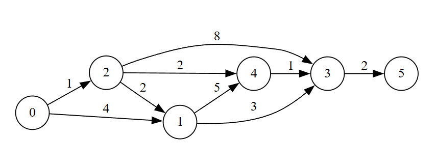
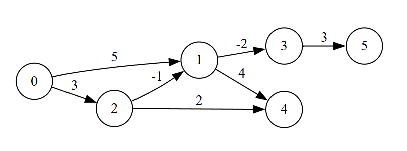

# Алгоритмы поиска кратчайших путей: Дейкстра и Беллман-Форд

Этот проект предоставляет реализации двух фундаментальных алгоритмов поиска кратчайших путей в графах:

- Алгоритм Дейкстры - для графов с неотрицательными весами ребер ([Алгоритм Дейкстры](#алгоритм-дейкстры))

- Алгоритм Беллмана-Форда - для графов с отрицательными весами и обнаружением отрицательных циклов ([Алгоритм Беллмана-Форда](#алгоритм-беллмана-форда))
- [Сравнительная таблица](#сравнительная-таблица)
- [Использование](#использование)
- [Заключение](#заключение)

## Алгоритм Дейкстры <a name="Алгоритм-дейкстры"></a>

### Принцип работы 

1.  Инициализирует расстояния до всех вершин как бесконечность, кроме стартовой вершины, расстояние до которой равно 0.
2.  На каждом шаге выбирает непосещенную вершину с наименьшим известным расстоянием до неё от стартовой вершины.
3.  Обновляет расстояния до всех соседей выбранной вершины: для каждого соседа вычисляет расстояние от стартовой вершины через выбранную вершину и, если оно меньше текущего известного расстояния до соседа, обновляет его. Этот процесс называется "релаксацией" ребра.
4.  Помечает выбранную вершину как посещенную.
5.  Повторяет шаги 2-4 до тех пор, пока все вершины не будут посещены.

### Преимущества 

*   Высокая производительность для разреженных графов O((n + m) log n), где n - количество вершин, m - количество рёбер.
*   Простота реализации с использованием приоритетной очереди (например, с использованием кучи).
*   Эффективен для графов с неотрицательными весами рёбер.

### Недостатки 

*   Не работает с графами, содержащими рёбра с отрицательными весами.
*   Не обнаруживает отрицательные циклы.

### Сложность 

|   Реализация   |  Временная сложность  |  Емкостная сложность |
| -------------- | --------------------- | -------------------- |
|    Базовая (массив)     |         O(n²)         |         O(n)         |
|Оптимизированная (куча)|   O((n + m) log n)    |         O(n)         |

### Идеальный случай 

*   Маршрутизация в компьютерных сетях.
*   Поиск кратчайших путей на картах (например, в GPS-навигаторах).
*   Системы навигации.
*   Планирование перемещения роботов.

## Алгоритм Беллмана-Форда <a name="Алгоритм-беллмана-форда"></a>

### Принцип работы 

1.  Инициализирует расстояния до всех вершин как бесконечность, кроме стартовой вершины, расстояние до которой равно 0.
2.  Последовательно релаксирует все рёбра графа V-1 раз, где V - количество вершин. Релаксация ребра (u, v) означает проверку, можно ли улучшить расстояние до вершины v, пройдя через вершину u.
3.  После V-1 итераций проверяет наличие отрицательных циклов: если после V-1 итераций возможно дальнейшее улучшение расстояния до какой-либо вершины, то в графе существует отрицательный цикл.

### Преимущества 

*   Работает с графами, содержащими рёбра с отрицательными весами.
*   Обнаруживает отрицательные циклы (если они есть).
*   Простая реализация без использования сложных структур данных.

### Недостатки 

*   Более медленный, чем алгоритм Дейкстры O(n*m), где n - количество вершин, m - количество рёбер.
*   Неэффективен для больших графов, где алгоритм Дейкстры может быть значительно быстрее.

### Сложность 

Временная сложность: O(n*m)

Емкостная сложность: O(n) для хранения расстояний до вершин.

### Идеальный случай 

*   Финансовые модели, где рёбра могут представлять прибыли или убытки (отрицательные стоимости).
*   Анализ сетей с возможными отрицательными весами, например, для обнаружения проблемных мест.
*   Обнаружение арбитражных возможностей на финансовых рынках.
*   Оценка кратчайших путей в сетях, где некоторые соединения могут иметь отрицательные задержки (хотя это и нереалистичный сценарий в большинстве практических ситуаций).

## Сравнительная таблица <a name="сравнительная-таблица"></a>

| Характеристика          |  Алгоритм Дейкстры (базовый)  |Алгоритм Дейкстры     | Алгоритм Беллмана-Форда |
| ----------------------  |  ---------------------------  | -------------------- | ----------------------- |
| **Временная сложность** |              O(n²)	          | O((n + m) log n)     | O(n*m)                  |
| **Память**              |              O(n)	          |  O(n)                |  O(n)                   |
| **Вес рёбер**           |       неотрицательные         | неотрицательные      | Любые                   |
| **Отрицательные циклы** |              Нет              |         Нет          |            Да           |
| **Структура данных**    |         Массив (базовый)      | Приоритетная очередь (куча) | Простой перебор  |
| **Применимость**        |Графы с неотрицательными весами|Графы с неотрицательными весами|Графы с любыми весами|

## Использование <a name="использование"></a>
### Пример кода <a name="пример-кода"></a>

Для использования алгоритмов необходимо:

1.  Включить заголовочные файлы `graph.h` и `algorithms.h`.
2.  Создать экземпляр класса `Graph` и добавить в него ребра.
3.  Вызвать функцию `dijkstra` или `bellmanFord` с указанием графа и начальной вершины.
4.  Обработать результаты.

#### Пример использования алгоритма Дейкстры:

```c++
#include "../include/graph.h"
#include "../include/algorithms.h"

int main() {
    // 1. Граф для алгоритма Дейкстры (положительные веса)
    Graph dijkstraGraph(6);
    dijkstraGraph.addEdge(0, 1, 4);
    dijkstraGraph.addEdge(0, 2, 1);
    dijkstraGraph.addEdge(1, 3, 3);
    dijkstraGraph.addEdge(1, 4, 5);
    dijkstraGraph.addEdge(2, 1, 2);
    dijkstraGraph.addEdge(2, 3, 8);
    dijkstraGraph.addEdge(2, 4, 2);
    dijkstraGraph.addEdge(3, 5, 2);
    dijkstraGraph.addEdge(4, 3, 1);

    auto dijkstraResult = dijkstra(dijkstraGraph, 0);
}
```



#### Пример алгоритма Беллмана-Форда:
```c++
int main() {
    // 2. Граф для алгоритма Беллмана-Форда (отрицательные веса без циклов)
    Graph bellmanGraph(6);
    bellmanGraph.addEdge(0, 1, 5);
    bellmanGraph.addEdge(0, 2, 3);
    bellmanGraph.addEdge(1, 3, -2);
    bellmanGraph.addEdge(1, 4, 4);
    bellmanGraph.addEdge(2, 1, -1);
    bellmanGraph.addEdge(2, 4, 2);
    bellmanGraph.addEdge(3, 5, 3);
    
    auto bellmanResult = bellmanFord(bellmanGraph, 0);
}
```


## Заключение <a name="заключение"></a>

Выбор между алгоритмом Дейкстры и алгоритмом Беллмана-Форда зависит от конкретных требований задачи. Если граф содержит только неотрицательные веса рёбер, алгоритм Дейкстры будет более эффективным. В случае наличия отрицательных весов или необходимости обнаружения отрицательных циклов, предпочтение следует отдать алгоритму Беллмана-Форда.

Таким образом, понимание принципов работы, преимуществ и недостатков этих алгоритмов позволяет выбирать наиболее подходящий метод для решения конкретных задач поиска кратчайших путей в графах.

## Дополнительные источники:
### Статьи
- [Пример реализации алгоритма Дейкстры на c++](https://www.geeksforgeeks.org/dsa/dijkstras-shortest-path-algorithm-greedy-algo-7/)
- [Теоретическая часть алгоритма Беллмана-Форда](https://cp-algorithms.com/graph/bellman_ford.html)
- [Теоретическая часть алгоритма Дейкстры](https://cp-algorithms.com/graph/dijkstra.html)
### Видео-уроки
- [Алгоритм Дейкстры](https://www.youtube.com/live/G9TNn6GVwtk?si=asRXq0zWloTkGo86)
- [Алгоритм Беллмана-Форда](https://youtu.be/oyt3rM7ksoU?si=NQUb3zuG5TodSC69)

## Сборка и Запуск
     mkdir build
     cd build
     cmake ..
     make
     ./DDZTests

