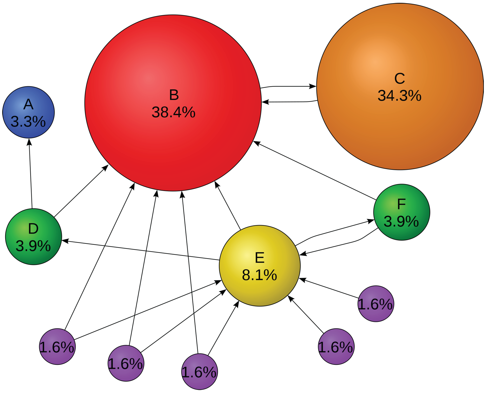

# **PageRank**

**PageRank** алгоритм ранжирования, который оценивает количество и качество ссылок, ведущих на веб-страницы. 
**Алгоритм ранжирования PageRank** - это алгоритм, используемый поисковыми системами для определения релевантности веб-страниц по запросу пользователя. Ранжирование основывается на том, что страницы с большим количеством важных внешних ссылок имеют больший вес (большую релевантность) по сравнению со страницами с меньшим количеством ссылок, либо с ссылками от менее значимых сайтов.  
**PageRank** — это попытка объективно оценивать страницы в соответствии с субъективным поведением пользователей: чем чаще на страницу ссылаются, тем более она полезна для людей, ищущих информацию. 
Алгоритм также учитывает авторитет ссылающихся источников: чем выше оценка PageRank у определенной страницы, тем больше веса она передаст другой странице, на которую ссылается.

## **Типичная схема алгоритма PageRank**

## **Описание кода**

Данный код начинается с объявления структуры Page, которая представляет веб-страницу и содержит имя, хеш имени и множество хешей страниц, на которые указывает данная страница.

Затем определена функция **parse_csv**, которая считывает данные из файла CSV, содержащего информацию о веб-страницах и их ссылках. Эта функция создает структуры Page для каждой веб-страницы и возвращает вектор этих структур.

Функция **getPageRank** принимает имя CSV-файла и использует функцию **parse_csv** для получения данных о веб-страницах. Cоздаётся матрица **H**, называемая матрицей гиперссылок, **H=Hij**, которая выступает в качестве матрицы смежности для оценки влияния каждой страницы на другую страницу.
Матрица смежности – это таблица размерностью **N x N** (где **N** – количество страниц в графе), которая показывает связи между страницами, где каждый элемент **Aij** матрицы равен **1**, если существует ссылка со страницы **i** на страницу **j**, и **0** в остальных случаях. Таким образом, матрица смежности представляет собой граф, где каждая вершина представляет веб-страницу, а каждое ребро между вершинами показывает наличие ссылки на другую страницу.

В алгоритме **PageRank** матрица смежности используется для расчета весов страниц. Алгоритм начинает работать с заданной начальной вероятностью для каждой страницы, которая обычно устанавливается как **1/N**, где **N**– количество  ссылок на страницу. Затем алгоритм применяет формулу для расчета веса каждой страницы. Вес страницы **i** вычисляется по формуле:

**P(i) = c∑(j) A(j,i) P(j) / L(j)**

где **P(i)** – вес страницы **i**, c – коэффициент затухания, **A(j,i)** – элемент матрицы смежности (равен **1**, если страница **j** ссылается на страницу **i** и **0** в противном случае), **L(j)** – количество исходящих ссылок со страницы **j**, **∑(j)** – сумма по всем страницам **j**, которые ссылаются на страницу **i**.

После вычисления весов для каждой страницы, алгоритм проводит несколько итераций до тех пор, пока изменения в весах страниц перестанут быть существенными. Количество итераций зависит от размера графа и точности, которую требуется достичь.

Следует отметить, что в поисковой системе Google   матрица **H** имеет около **n=25** миллиардов столбцов и строк. Однако большинство записей в **H** равны нулю; фактически, исследования показывают, что веб-страницы имеют в среднем около **10** ссылок, а это означает, что в среднем все, кроме **10** записей в каждом столбце, равны нулю.
Другими словами матрица смежности может иметь нулевые строки, что означает, что ссылок на данную страницу не обнаружено. При использовании матрицы смежности в алгоритме **PageRank** для расчета весов страниц, страницы с нулевыми строками могут считаться весом **0** и не влияют на ранжирование. 

 Матрица **H** обладает некоторыми особыми свойствами. Во-первых, все элементы матрицы **H** неотрицательны. Кроме того, сумма элементов в столбце равна единице (за исключением столбцов, которые соответствуют страницам, не имеющим ссылок). Матрицы, в которых все элементы неотрицательны и сумма элементов в каждом столбце равна единице, называются стохастическими.

Затем происходит обновление вектор **I**, компонентами которого являются PageRanks, т. е. рейтинги важности, всех страниц.
Данный вектор определяется следующим образом:
**I=H∙I**
 Другими словами, вектор <b>I</b> является собственным вектором матрицы <b>H</b> с собственным значением <b>1</b> или стационарным вектором матрицы <b>H</b>.
 В каждой итерации цикла вычисляется значение суммы всех элементов вектора <b>I</b>, а затем вычисляется вектор <b>HI</b> размерности <b>N</b> - где <b>N</b> количество строк (то есть количество страниц). Затем вектор <b>I</b> обновляется согласно формуле <b>PageRank</b>:
  <b>I[i] = alpha * (HI[i] + sum) + (1 - alpha) / N * val</b>  где  <b>alpha</b> - это константа затухания (обычно равна <b>0.85</b>), <b>HI[i]</b> - это сумма произведений <b>i-го</b> столбца матрицы <b>H</b> на соответствующий элемент вектора <b>I</b>, <b>sum</b> - среднее значение элементов в столбцах, <b>val</b> - это сумма всех элементов вектора <b>I, N</b> - это размер вектора <b>I</b>.
  <b>(Подробнее о работе алгоритма  <a href = "https://drive.google.com/file/d/1xJ_daR_kWqB7sfrXVhbof3wNJh1WwFq7/view?usp=drive_link">тут</a> )</b>

В итоге, функция **getPageRank** переупорядочивает вектор элементов, чтобы выводить имена вместе с значениями ранга страниц. Это позволяет определить наиболее важные веб-страницы в сети.

##  **Сложность алгоритма**
Теоретическая временная сложность алгоритма **PageRank** составляет **O( N2 )**, где **N** - это количество узлов в графе. Это происходит из-за необходимости умножения матрицы **H** размером **N × N** на вектор **I**. 

Однако за счет специфики структуры матрицы **H** (она разрежена, т.е. большинство элементов равны нулю), в практическом смысле алгоритм **PageRank** выполняется гораздо быстрее. Во многих случаях, например, при использовании алгоритмов линейной алгебры со специальной оптимизацией для разреженных матриц, время работы быстро уменьшается и может достигать **O(N logN)** или даже **O(N)**. 

Практическая временная сложность алгоритма **PageRank** зависит от различных факторов, таких как количество узлов в графе, плотность связей между узлами, аппаратное и программное обеспечение, используемое для вычислений и специализированные алгоритмы и оптимизации, применяемые для достижения наилучшей производительности.

### Вывод

Cложность                             |
---------------------------------     | 
**Теоретическая:**  ***O( N2 )***  
**Практическая:** ***(N logN)*** или ***O(N)***

## **Недостатки алгоритма**

**Алгоритм ранжирования PageRank имеет следующие недостатки:**

***1. В алгоритме PageRank не учитывается текст на веб-страницах, он определяет ранжирование только на основе ссылок. Это означает, что он не может определить, насколько релевантна страница запросу пользователя.***

***2. Алгоритм PageRank является вычислительно сложным и требует большого количества вычислений. При большом числе страниц это может занять много времени и ресурсов.***

***3. Алгоритм PageRank учитывает только входящие ссылки на страницу. Это означает, что страницы, которые не имеют входящих ссылок, будут иметь низкий ранг, несмотря на то, что они могут быть очень релевантны запросу пользователя.***

***4. Алгоритм PageRank подвержен манипуляциям, таким как установка искусственных ссылок на страницу, чтобы искусственно увеличить ее ранг.***

***5. Алгоритм PageRank не учитывает контекст внешних ссылок. Ссылки со страниц, которые имеют высокий ранг, могут не быть релевантными запросу пользователя.***

***6. Алгоритм PageRank не учитывает социальные сигналы, такие как лайки, репосты и комментарии, которые могут помочь определить реальную популярность страницы у пользователей.***

***7. Алгоритм PageRank не учитывает нишевые запросы, которые могут быть релевантны только для определенной группы пользователей.***
