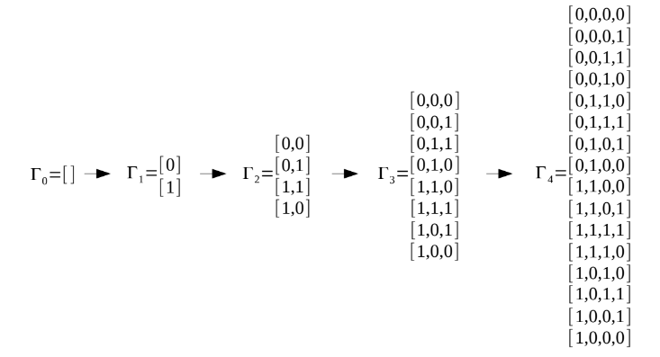
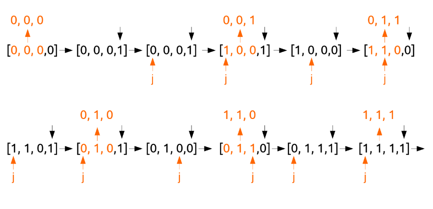
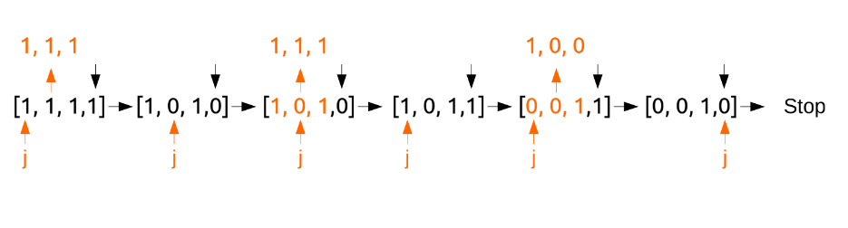
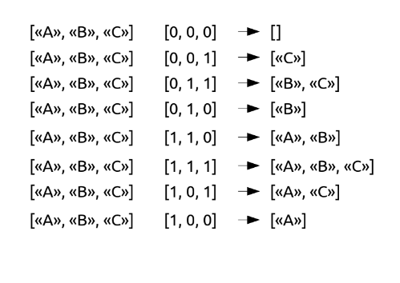

# Алгоритм порождения подмножеств с использованием кодов Грея

**Двоичный код Грея** — способ перечисления всех 2<sup>n</sup>
битовых строк из n бит, таким образом что
при следующем перечислении изменяется только один бит, само изменение детерминировано и регулярно.
Например двоичный код Грея для n=4.
```
0000
0001
0011
0010
0110
0111
0101
0100
1100
1101
1111
1110
1010
1011
1001
1000
```

Код Грея можно определить рекурсивно для количества элементов в нем.
Γ<sub>0</sub>=[ ] (по определению)

**Γ<sub>n</sub>=0Γ<sub>n−1</sub>, 1Recursive(Г<sub>n−1</sub>)**.

0Γ<sub>n−1</sub> - строки из предыдущей последовательности дополненные 0 спереди.

1Recursive(Γ<sub>n−1</sub>) - строки из предыдущей последовательности взятые в обратном порядке и дополненные 1
спереди.


## Пример генерации



**Сложность по времени в наихудшем случае** O(2<sup>n</sup>)

## Описание алгоритма кода Грея

```
1) Создать дополнительную последовательность размером n+1 (в дальнейшем a). Заполнить ее
нулями. Объявить дополнительную переменную j=0. Перейти к 2.
2) Вернуть первые n элементов последовательности в реверсивном порядке. Перейти к 3.
3) Установить a[n]=1-a[n] перейти к 4.
4) Если a[n]==1 установить j=0. В противном случае начиная с начала последовательности
выполнить поиск элемента для которого a[j]==1. Установить j=j+1. Перейти к 5.
5) Если j==n завершить алгоритм. Установить a[j]=1-a[j] перейти к 2.
```

## Графическое пояснение алгоритма для n=3




## Основные функции и их сложность

### Нерекурсивный генератор кода Грея

Функция `GrayCode` в качестве параметра принимает размер будущего кода Грея `size`. Она реализована за счёт использования циклов. Возвращает массив сгенерированных кодов Грея.

**Сложность: O(2<sup>n</sup>)**

### Рекурсивный генератор кода Грея

Функция `RecursiveGrayCode` в качестве параметра принимает размер будущего кода Грея `size`. Она реализована за счёт вызова функции рекурсивного итерирования со следующими параметрами:
+ размер генерируемого кода Грея `size` 
+ результирующий массив `result`
+ дополнительная последовательность `arr`
+ дополнительная переменная `j`
+ индекс места вставки элемента в результирующий массив `index`

Возвращает массив сгенерированных кодов Грея.

**Сложность: O(2<sup>n</sup>)**


## Подмножества

Множество A называется подмножеством B, если все элементы, принадлежащие А, также
принадлежат и B.
```
(A ⊂ B) ⇔ (∀x (x∈A ⇒ x∈B))
```
А может может быть подмножеством B строго. Все
элементы А есть в В, но в В есть элементы которых нет в А.

А может может быть подмножеством B не строго. Все
элементы А есть в В, и все элементы в В есть в А.
```
(A ⊆ B) ⇔ (A ⊂ B) ∧ (B ⊂ A)
```

Каждое множество обязательно содержит следующие подмножества: пустое, само множество.
Такие подмножества называют несобственными, остальные подмножества называют
собственными. Каждое множество обладает 2<sup>n</sup>
подмножеств.

## Описание алгоритма генерации подмножеств
```
1) Создать двоичный код Грея для n равно размеру множества.
2) Выполнить проход по кортежам составляющим двоичный код Грея. Для каждого кортежа, выполнить проход по элементам множества. Если текущим элементом кортежа является 1 то текущий элемент множества включается в подмножество, если 0 то нет.
```

## Пример алгоритма на множестве ```{A, B, C}```




## Создание подмножеств с использованием кодов Грея

### Шаблонная функция

Функция `GenerateSubsets` создает подмножества для заданной шаблонной последовательности `sequince`. Ещё одним её параметром является функтор `(*function)(int)`, в котором передается используемая функция генерации кода Грея. Результирующий массив состоит из подмножеств элементов из заданной последовательности, которые определяются по сгенерированному коду Грея, в котором 1 означает, что элемент включён в подмножество, а 0 - не включён.

Возвращает массив подмножеств.

**Сложность: O(2<sup>n</sup>)**

## Список литературы
```
Д. Кнут. Искусство программирования. Том 4. «Генерация всех кортежей и
перестановок», 2-е изд. ISBN 5-8459-0082-4 с.83-113
