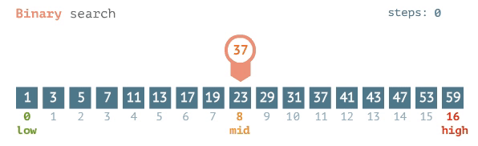

# Алгоритм Бинарного Поиска

**Бинарный поиск** — это эффективный алгоритм поиска элементов в отсортированном массиве, работающий за время O(log n). Алгоритм последовательно делит пространство поиска пополам, сравнивая средний элемент с искомым значением.

## 📊 Принцип работы алгоритма

1. **Инициализация границ**:  
   `left = 0`, `right = размер_массива - 1`
2. **Цикл поиска** (пока `left <= right`):
   - Вычисление середины: `mid = left + (right - left) / 2`
   - Сравнение `arr[mid]` с искомым значением:
     - Равно → элемент найден (возвращаем `mid`)
     - Меньше → `left = mid + 1`
     - Больше → `right = mid - 1`
3. **Элемент не найден** → возврат `-1`

### 🔍 Визуализация



**Пример поиска числа 37** в массиве arr = `[1, 3, 5, 7, 11, 13, 17, 19, 23, 29, 31, 37, 41, 43, 47, 53, 59]`:

- Шаг 1:
  - left = 0, right = 16: `[1, 3, 5, 7, 11, 13, 17, 19, 23, 29, 31, 37, 41, 43, 47, 53, 59]`:
  - mid = 8 → arr[8] = 23 < 37 → left = 9
- Шаг 2:
  - left = 9, right = 16: `[29, 31, 37, 41, 43, 47, 53, 59]`:
  - mid = 12 → arr[12] = 41 > 37 → right = 11
- Шаг 3:
  - left = 9, right = 11: `[29, 31, 37]`:
  - mid = 10 → arr[10] = 23 < 37 → left = 11
- Шаг 4:
  - left = 11, right = 11: `[37]`:
  - mid = 11 → arr[11] = 37 == 37 → Элемент найден

## Основные характеристики

### Условия применения

- Массив должен быть отсортирован
- Доступ к элементам по индексу за O(1)

## 💻 Реализации алгоритма

### 1. Рекурсивная реализация (`include/BinarySearchRecursive.h`)

```cpp
template <typename T>
int binarySearchRecursive(const std::vector<T>& arr, int left, int right, const T& key) {
    if (left > right) return -1;

    int mid = left + (right - left) / 2;

    if (arr[mid] == key) return mid;
    else if (arr[mid] > key)
        return binarySearchRecursive(arr, left, mid - 1, key);
    else
        return binarySearchRecursive(arr, mid + 1, right, key);
}
```

### Особенности

✅ Простая и элегантная реализация

❌ Требует O(log n) памяти для стека вызовов

⚠️ Риск переполнения стека при больших массив

### 2. Итеративная реализация (include/BinarySearchIterative.h)

```cpp
template <typename T>
int binarySearchIterative(const std::vector<T>& arr, const T& key) {
    int left = 0;
    int right = arr.size() - 1;

    while (left <= right) {
        int mid = left + (right - left) / 2;

        if (arr[mid] == key) return mid;
        else if (arr[mid] < key) left = mid + 1;
        else right = mid - 1;
    }
    return -1;
}
```

### Особенности

✅ Оптимальное использование памяти (O(1))

✅ Отсутствие риска переполнения стека

✅ Предпочтительна для production-кода

## 🔬 Анализ сложности

**Ключевое понимание:** Каждое сравнение в бинарном поиске определяет один бит информации о позиции искомого элемента.

Поскольку:

- Для представления любого числа в диапазоне [0, n-1] требуется log₂(n) битов

- Каждая итерация определяет один бит информации

- В худшем случае требуется определить все log₂(n) битов

**Следовательно сложность: O(log n)**

Это объясняет, почему:

- Для массива из 1024 элементов требуется не более 10 итераций (2¹⁰ = 1024)

- Для массива из 1 миллиона элементов требуется не более 20 итераций (2²⁰ ≈ 1e6)

- Для массива из 1 миллиарда элементов требуется не более 30 итераций (2³⁰ ≈ 1e9)

## ⚖️ Сравнение реализаций

| Критерий     | Рекурсивная      | Итеративная     |
| ------------ | ---------------- | --------------- |
| Сложность    | O(log n)         | O(log n)        |
| Память       | O(log n)         | O(1)            |
| Удобство     | Проще читать     | Эффективнее     |
| Ограничения  | Глубина рекурсии | Нет ограничений |
| Безопасность | ⚠️ Риск стека    | ✅ Безопасна    |
| Применение   | Обучение         | Продакшн        |

## Пример использования

```cpp
#include <vector>
#include "BinarySearchRecursive.h"
#include "BinarySearchIterative.h"

int main() {
    std::vector<int> data = {1, 2, 3, 4, 5, 6, 7, 8, 9, 10};

    // Рекурсивный поиск
    int index1 = binarySearchRecursive(data, 0, data.size()-1, 7);

    // Итеративный поиск
    int index2 = binarySearchIterative(data, 7);

    return 0;
}
```

## 🧪 Тестирование

### Тесты покрывают

- Поиск в начале/середине/конце массива

- Отсутствующие элементы

- Пустые массивы и массивы из 1 элемента

- Разные типы данных (int, double)

- Дубликаты элементов

## 🛠 Инструкция по сборке

### Требования

- Компилятор C++17 (g++ 7+/clang++ 5+/MSVC 19.14+)
- CMake 3.12+
- Тестовая библиотека: Google Test

### Сборка проекта (Linux/macOS)

```bash
cd BinarySearch

# Создание директории для сборки
mkdir build
cd build

# Генерация Makefile
cmake ..

# Сборка проекта
make

# Запуск тестов
./BinarySearchTests
```

### Сборка проекта (Windows)

```powershell
# Клонирование репозитория
git clone https://github.com/yourusername/BinarySearch.git
cd BinarySearch

# Создание директории для сборки
mkdir build
cd build

# Генерация проекта Visual Studio
cmake -G "Visual Studio 17 2022" ..

# Сборка в конфигурации Release
cmake --build . --config Release

# Запуск тестов
.\Release\BinarySearchTests.exe
```
