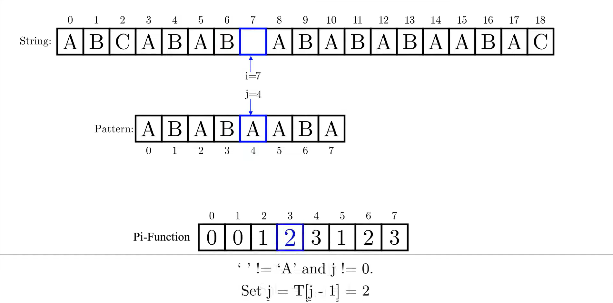

# Алгоритм Кнута-Морриса-Пратта (КМП)

**Алгоритм Кнута-Морриса-Пратта** — это эффективный алгоритм для поиска подстроки в тексте. Его основная идея — предварительное вычисление таблицы префикс-функции (π-функции), которая позволяет избежать повторного сравнения символов.

## Типичная схема алгоритма



## Основные операции и их сложность

### Построение π-функции

Представим, что у нас есть строка (её часто называют паттерном), например, `abcab`, и мы хотим построить для неё так называемую ***π-функцию***. Эта функция нужна для того, чтобы во время поиска этой строки в каком-то большом тексте не приходилось возвращаться в самое начало при каждом несовпадении, а можно было бы «умно» перескочить к уже проверенной части строки. Чтобы этого добиться, мы заранее изучаем саму строку и выясняем, какие её части повторяются внутри неё самой. Эта информация и записывается в ***π-функцию***.

Итак, ***π-функция*** — это массив той же длины, что и наша строка. В каждой позиции `i` этого массива мы храним число, которое означает: какова максимальная длина префикса (начала строки), который совпадает с суффиксом (концом строки) в подстроке от начала до этой позиции включительно. То есть мы смотрим на подстроку от `pattern[o]` до `pattern[i+1]` и пытаемся найти такой её кусок, который одновременно является началом и концом этой подстроки, но не является всей подстрокой целиком.

Построение ***π-функции*** начинается с инициализации массива нулями. Самая первая позиция всегда будет нулевой, потому что в одной единственной букве не может быть совпадающего префикса и суффикса. Далее мы начинаем рассматривать подстроки с двух символов и дальше, и по каждой позиции пытаемся определить, какова длина самого длинного префикса, который совпадает с суффиксом до этой позиции.

Для этого мы используем переменную `j`, которая показывает, сколько символов уже совпало между текущей позицией и началом строки. Если символ на позиции `i` совпадает с символом на позиции `j`, значит, совпадение продолжается, мы увеличиваем `j` на 1 и записываем это значение в `pi[i]`. Это означает, что в подстроке до `i` включительно совпадает `j` символов с её началом.

Но если символы не совпадают, значит, у нас произошёл «облом» — раньше всё совпадало, но сейчас символы разные. Тогда мы не возвращаемся к самому началу строки, а делаем хитрый трюк: мы смотрим в ***π-функцию*** для предыдущей позиции (то есть `pi[j-1]`) и откатываемся назад к той длине совпадения, которая была до этого. Это позволяет не начинать сравнение с нуля, а попробовать использовать уже найденный повтор. Мы продолжаем откатываться по ***π-функции*** до тех пор, пока либо не найдём совпадение, либо не дойдём до нуля.

В случае, если после всех откатов символы всё же совпадают — мы продолжаем, увеличиваем `j` и записываем его в `pi[i]`. Если так и не нашли совпадение, оставляем `pi[i]` равным нулю.

Весь этот процесс повторяется для каждой позиции в строке, начиная со второй (индекс 1). В результате получается массив, в котором для каждой позиции указано, насколько далеко можно «откатиться» при неудаче во время поиска, чтобы не проверять уже заведомо совпавшие символы.

Простой пример: пусть у нас есть строка `abcab`. Мы начинаем с позиции 1 (`b`). Она не совпадает с первым символом (`a`), значит, ***π-функция*** для этой позиции равна 0. Дальше идём на позицию 2 (`c`) — тоже не совпадает с началом, π снова 0. На позиции 3 стоит `a` — она совпадает с первым символом (`a`), значит, совпадение длины 1, и в `pi[3]` записываем 1. Следующая позиция — `b`, и она совпадает со вторым символом (`b`), значит, уже два совпавших символа подряд — записываем `pi[4]` = 2. В итоге получаем массив π: [0, 0, 0, 1, 2].

Этот массив потом используется при поиске, чтобы быстро перескакивать по строке при несовпадениях и не тратить время на повторные сравнения. Всё это делает алгоритм Кнута-Морриса-Пратта очень быстрым — он работает за линейное время и особенно полезен, если мы ищем одну и ту же подстроку много раз в разных текстах.

**Сложность: O(m)**

### Поиск подстроки

Мы идём по тексту символ за символом. У нас есть два указателя:

`i` — позиция в тексте.

`j` — позиция в паттерне (сравниваемый символ).

Если символы `text[i]` и `pattern[j]` совпадают, мы двигаем оба указателя вперёд. То есть продолжаем искать совпадение дальше.

Если все символы паттерна совпали (`j` достиг конца паттерна) — значит, мы нашли подстроку в тексте, и запоминаем позицию, с которой она начинается: это `i` - m + 1, где m — длина паттерна.

Если `text[i]` не совпал с `pattern[j]`, то алгоритм выполняет откат по ***π-функции*** (по сути — перескакивает назад внутри шаблона, а не текста):

Если `j` > 0, то мы не обнуляем `j`, а устанавливаем `j` = `π[j - 1]`. Это позволяет использовать уже вычисленные совпадения и не сравнивать заново.

Если `j` == 0, то совпадений нет, и мы просто сдвигаем `i` — увеличиваем его на 1 (переходим к следующему символу текста).

Поиск в КМП — это как у опытного читателя, который читает строку и, если вдруг что-то не совпало, не бросается перечитывать всё сначала, а вспоминает: "ага, тут уже был похожий кусок — начну с него!". Благодаря этому КМП не повторяет работу, уже проделанную ранее, и делает поиск подстроки за линейное время.

**Сложность: O(n)**

где:
- `n` — длина текста
- `m` — длина паттерна

### Вывод

Построение ***π-функции*** и поиск подстроки выполняются за линейное время относительно длины текста и паттерна.

| Построение ***π-функции***  |           Поиск подстроки          |
|-----------------------|------------------------------------|
| O(m)                  | мин: O(n)  сред: O(n)  макс: O(n+m)|

## Пример

**Текст:** `abcabcabcabc`  
**Паттерн:** `abcab`

Построение ***π-функции***:
```
π: [0, 0, 0, 1, 2]
```
[Видео пример алгоритма Кнута-Морриса-Пратта](https://www.youtube.com/watch?v=pu2aO_3R118)

### Сборка и запуск проекта
0.  открыть в консоли папку с проектом 
1.  `mkdir build && cd build`
2.  `cmake ..`
3.  `make`