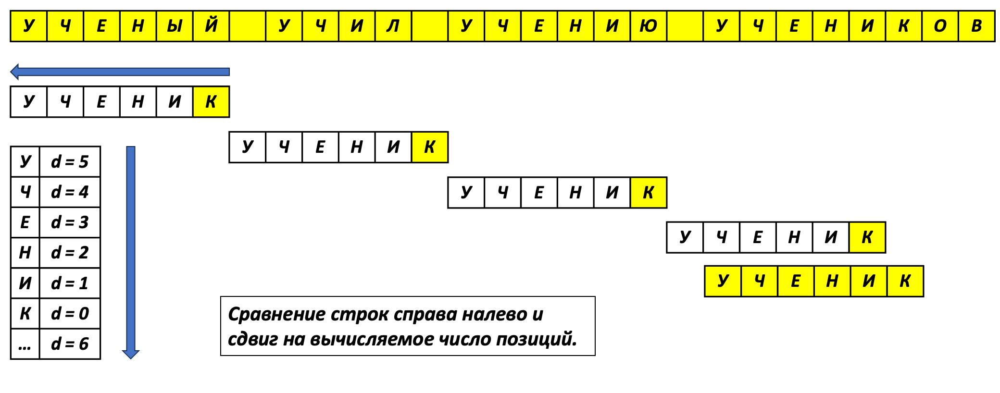

# Алгоритм Бойера-Мура: революция в поиске подстрок

**Алгоритм Бойера-Мура** - это не просто эффективный метод поиска, а настоящая революция 1977 года, созданная Робертом Бойером и Джеем Муром. Его уникальность в том, что он часто пропускает значительные части текста без проверки, достигая в лучших случаях сублинейной сложности!

## Почему этот алгоритм особенный?

### Нестандартный подход к сравнению
В отличие от наивного алгоритма, который:
- Двигается слева направо
- Сравнивает символы последовательно
- Делает минимальные сдвиги (на 1 символ)

Бойер-Мур использует **три революционные идеи**:
1. Сравнение справа налево
2. Эвристика "плохого символа"
3. Эвристика "хорошего суффикса"

## Эвристика плохого символа: интеллектуальные прыжки

Визуальная схема работы алгоритма.


### Как работает эта магия?
Когда обнаруживается несовпадение:
1. **Символ текста отсутствует в образце**:
   - "Прыгаем" на всю длину образца
   - Пример: ищем "ABCDB" в "...A..." (A нет в ABCD) → сдвиг на 5 позиции

2. **Символ есть в образце**:
   - Выравниваем последнее вхождение символа в образце с текущей позицией
   - Пример: ищем "ABCDB" в "...C..." → выравниваем вторую B
   
```
Текст:    Z A C X B X C A B C D B
Шаг 1:    A B C D B (несовпадение 'X' → сдвиг +5)
Шаг 2:          A B C D B (несовпадение 'C' → сдвиг +2)
Шаг 3:            A B C D B (полное совпадение!)
```

### Исторический контекст
В 1977 году, когда алгоритм создавался:
- Использовались ASCII-символы (128-256 значений)
- Создание массива на 256 элементов было приемлемо
- Сегодня с Unicode (1,112,064 символа) требуются оптимизации

**Производительность**:
- Лучший случай: O(n/m) - когда часто встречаются "плохие" символы
- На естественных языках: в 3-5 раз быстрее наивного алгоритма

## Эвристика хорошего суффикса: скрытый потенциал

### Три уровня мудрости
1. **Совпадение внутри образца**:
   - Нашли "AB" в конце? Ищем такое же "AB" левее
   - Сдвигаем до этого положения

2. **Частичное совпадение с префиксом**:
   - Если совпавший суффикс совпадает с началом образца
   - Пример: ищем "ABACAB":
     Совпало "AB" в конце → совмещаем с "AB" в начале

3. **Полный провал**:
   - Если ничего не совпало - прыгаем на всю длину

| Суффикс | Сдвиг |
|---------|-------|
| N       | 6     |
| AN      | 6     |
| MAN     | 3     |
| PANMAN  | 2     |

```
1. Попытка [i=0]:
Текст:    C O N A N P A N M A N X X
Шаблон:   A N P A N M A N
                    ! ✓ ✓  → Совпал суффикс "AN" (длина=2)
Несовпадение: 'P' (текст) ≠ 'M' (шаблон)
Сдвиг = 6 (из таблицы для "AN")

2. Попытка [i=6]:
Текст:    C O N A N P A N M A N X X
Шаблон:         A N P A N M A N
                ✓ ✓ ✓ ✓ ✓ ✓ ✓ ✓ → Полное совпадение
```

### Почему это мощно?
- Особенно эффективно для:
  - Биологических последовательностей (малый алфавит)
  - Повторяющихся паттернов
- В ДНК-анализе ускоряет поиск в 10+ раз по сравнению с KMP

Секрет успеха - в **использовании двух эвристик**:
1. На каждом шаге вычисляем оба возможных сдвига
2. Выбираем максимальный из них
3. Результат - минимальное число сравнений

**Реальные цифры**:
| Алгоритм          | Повторы (аааа) | ДНК | Английский текст |
|-------------------|---------------|-----|------------------|
| Наивный           | 8,785 ops/sec | 6k  | 30-57k           |
| KMP               | 84k ops/sec   | 161k| 120-160k         |
| BM (плохой символ)| 9k ops/sec    | 75k | 45-98k           |
| BM (обе эвристики)| 10k ops/sec   | 508k| 135-230k         |

## Анализ сложности

Реальная производительность зависит от:
1. **Коэффициента уникальности** образца
2. **Размера алфавита**
3. **Распределения символов** в тексте

**Математическое ожидание сдвига**:
Для образца "дуб" в русском тексте:
- Вероятность встретить "плохой" символ: 93%
- Средний сдвиг: 2.8 символа
- Сравнений: в 5 раз меньше, чем у наивного алгоритма

## Проблемы использования алгоритма в настоящее время

1. **Проблема Unicode**:
   - Оригинальный подход с массивом неэффективен
   - Современные решения:
     - Хэш-таблицы
     - Адаптивные битовые карты
     - Комбинация с машиным обучением

2. **Аппаратные оптимизации**:
   - SIMD-инструкции
   - Параллельное исполнение
   - Кэш-дружественные структуры данных

# Будущее развития
- Гибридные алгоритмы (BM-Horspool)
- Квантовые версии
- Нейросетевые предобработчики

# Дополнительные источники
- https://habr.com/ru/articles/660767/
- https://vk.com/video313356016_456239228?to=L3ZpZGVvMzEzMzU2MDE2XzQ1NjIzOTIyOD8-

### Сборка и компиляция
1. `mkdir build && cd build`
2. `cmake ..`
3. `make`