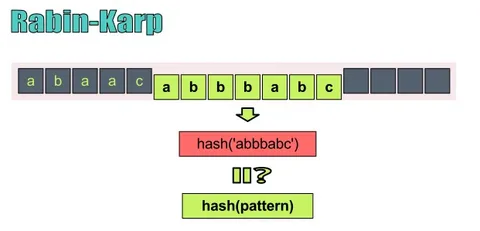
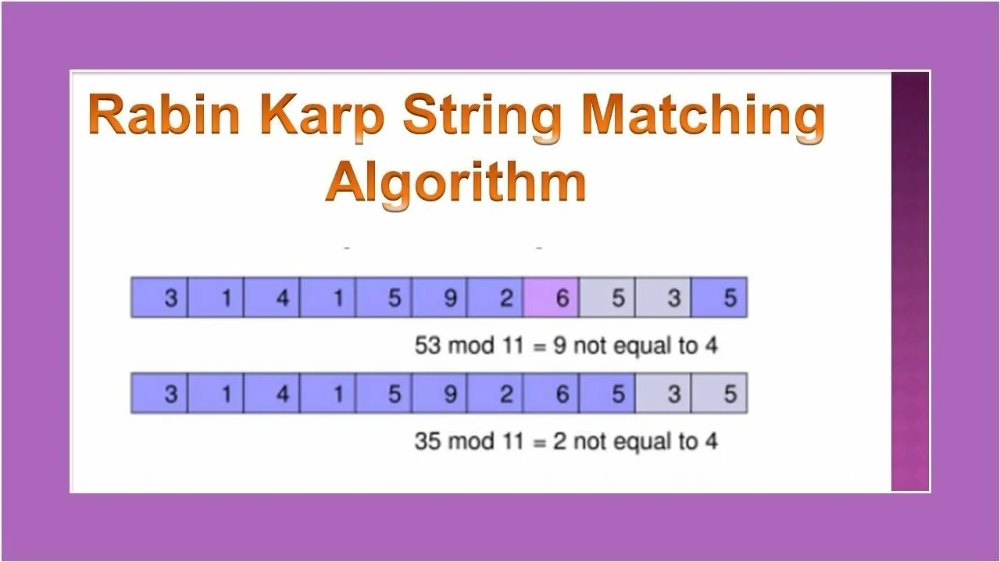

# Алгоритм Рабина-Карпа
## Описание алгоритма
Алгоритм Рабина-Карпа — это алгоритм поиска подстроки в строке, использующий хеширование для эффективного сравнения подстрок. Он особенно полезен при поиске нескольких образцов в тексте или при обнаружении повторяющихся паттернов.
### Логика алгоритма Рабина-Карпа для поиска подстроки в строке:

1. **Инициализация параметров:**

   - Определить длину текста и длину шаблона (подстроки).
   - Выбрать основание для хеширования (например, число возможных символов, часто 256).
   - Выбрать простое число для вычисления остатка по модулю (чтобы избежать переполнения и снизить коллизии).

2. **Вычисление начального хеша:**

   - Вычислить хеш значения шаблона.
   - Вычислить хеш первого окна текста той же длины, что и шаблон.

3. **Скользящее сравнение:**

   - Пройтись по тексту, сдвигая окно длины шаблона с начала до конца.
   - На каждом шаге сравнить хеш текущего окна текста с хешем шаблона.
   - Если хеши совпали, выполнить посимвольное сравнение для подтверждения совпадения (чтобы исключить ложные срабатывания из-за коллизий хеша).
   - Если совпадение подтверждено, сохранить индекс начала совпадения.

4. **Обновление хеша для следующего окна:**

   - Вычислить хеш следующего окна текста, используя хеш предыдущего окна, вычтя вклад первого символа предыдущего окна и добавив вклад следующего символа.
   - Использовать модульное арифметическое для поддержания хеша в пределах.

5. **Возврат результата:**

   - По окончании прохода по тексту вернуть список всех найденных позиций совпадений шаблона в тексте.

## Типичная схема работы алгоритма:

1. Вычисление хеша искомого образца (pattern)

2. Последовательное вычисление хешей для всех возможных подстрок текста той же длины

3. Сравнение хешей, и только при совпадении - полное сравнение символов

## Основные операции и их сложность
### Поиск подстроки
Алгоритм использует "скользящее хеширование" для эффективного вычисления хешей подстрок. В худшем случае (когда все хеши совпадают) требуется полное сравнение символов.

### Сложность:

Средний случай: O(n + m)

Худший случай: O(n*m)

где n - длина текста, m - длина образца

### Предварительная обработка
Перед поиском алгоритм вычисляет:

Хеш искомого образца

Значение BASE^(m-1) mod PRIME для эффективного пересчета хеша

Сложность: O(m)

### Скользящее хеширование
При переходе к следующей подстроке хеш пересчитывается за константное время с использованием предыдущего значения.

Сложность: O(1) на каждую подстроку

## Преимущества и недостатки
### Преимущества:

Эффективен при поиске нескольких образцов

Хорошо подходит для поиска повторяющихся паттернов

Может быть адаптирован для двумерного поиска

### Недостатки:

В худшем случае работает медленно

Требует аккуратного выбора параметров хеширования

| Операция          | Средний случай | Худший случай |
|-------------------|----------------|---------------|
| Предобработка     | O(m)           | O(m)          |
| Поиск            | O(n + m)       | O(n*m)        |
| Скользящее хеширование | O(1)       | O(1)          |
## Применение
### Алгоритм Рабина-Карпа полезен в:

Поиске плагиата в текстах

Анализе ДНК-последовательностей

Обнаружении вредоносных сигнатур

Поиске изображений в изображениях (при адаптации)

# Дополнительные исчники

# Сборка и запуск проекта