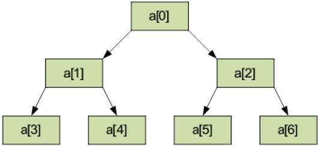

# Пирамидальная сортировка

**Пирамидальная сортировка** — это метод сортировки сравнением, основанный на такой структуре данных как двоичная куча. Она похожа на сортировку выбором, где мы сначала ищем максимальный элемент и помещаем его в конец. Далее мы повторяем ту же операцию для оставшихся элементов.

Давайте сначала определим законченное двоичное дерево. 
**Законченное двоичное дерево** — это двоичное дерево, в котором каждый уровень, за исключением, возможно, последнего, имеет полный набор узлов, и все листья расположены как можно левее.

**Двоичная куча** — это законченное двоичное дерево, в котором элементы хранятся в особом порядке: значение в родительском узле больше (или меньше) значений в его двух дочерних узлах. Первый вариант называется max-heap, а второй — min-heap. Куча может быть представлена двоичным деревом или массивом.

## Куча имеед следующий вид (a[i] ≤ a[2i+1]; a[i] ≤ a[2i+2].)

## **Выполнение алгоритма разбивается на два этапа.**

**1 этап Построение пирамиды.** Определяем правую часть дерева, начиная с n/2-1 (нижний уровень дерева). Берем элемент левее этой части массива и просеиваем его сквозь пирамиду по пути, где находятся меньшие его элементы, которые одновременно поднимаются вверх; из двух возможных путей выбираете путь через меньший элемент.

**2 этап Сортировка на построенной пирамиде.** Берем последний элемент массива в качестве текущего. Меняем верхний (наименьший) элемент массива и текущий местами. Текущий элемент (он теперь верхний) просеиваем сквозь n-1 элементную пирамиду. Затем берем предпоследний элемент и т.д.

## **Основные операции и их сложность**

 Сортировка, работает в худшем, в среднем и в лучшем случае (то есть гарантированно) за **O(nlog n)** операций при сортировке 
n элементов. Алгоритм работает «на месте» — количество задействованной служебной памяти **O(1)**, то есть фиксированное.

## **Недостатки сортировки**

- Неустойчива — для обеспечения устойчивости нужно расширять ключ.

- На почти отсортированных массивах работает столь же долго, как и на хаотических данных.

- На одном шаге выборку приходится делать хаотично по всей длине массива — поэтому алгоритм плохо сочетается с кэшированием и подкачкой памяти.

- Методу требуется доступ к произвольному элементу структуры; не работает на связанных списках и других структурах памяти последовательного доступа.

- Не распараллеливается.
