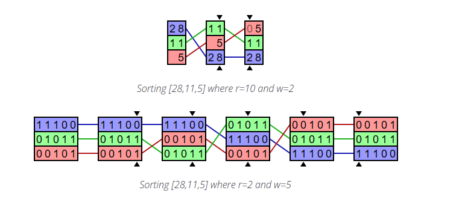
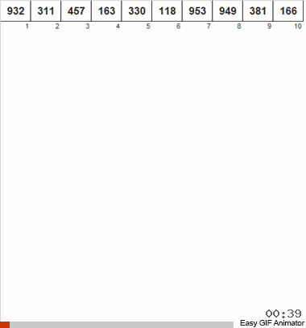
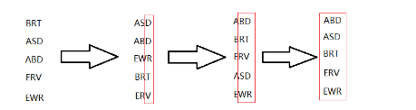

# LSD сортировка

**LSD** — Метод поразрядной сортировки сначала по младшей цифре (LSD – Lost Significant Digit radix sort) предусматривает просмотр разрядов справа налево. Обязательным условием корректной работы данного алгоритма является необходимость обеспечения устойчивости сортировки на каждом шаге, что достигается использованием очередей в качестве вспомогательных структур данных.

**Общие понятия** - 
Итак, предложенная сортировка является устойчивой. Сортировать будем целые 32 битные числа. Для работы потребуется ~(n+4Кбайт) дополнительной памяти, что несколько расточительно, но позволяет добиться некоторого увеличения производительности.

В данной разновидности LSD не используются сравнения и обмены, алгоритм полностью линеен. Вычислительная сложность O(N).

Основной особенностью алгоритма является высокая эффективность для сильно перемешанных или случайных наборов данных. На почти отсортированных наборах имеет смысл применять другие алгоритмы, так как выигрыш будет не так значителен. Плохо работает на малых массивах, менее пары сотен элементов.

**Принцип работы алгоритма**

LSD - это несопоставимый алгоритм сортировки целых чисел, который, благодаря своей стабильной способности сортировки, может помочь в сортировке данных с помощью целочисленных ключей, группируя ключи по отдельным цифрам, которые имеют одинаковую значимую позицию и значение.

Эта реализация сортировки по основанию называется сортировкой по основанию наименьшей значащей цифры (LSD), потому что мы начинаем с рассмотрения самой правой цифры каждого целого числа и продвигаемся влево (т.е. мы начинаем с наименее значащей цифры и движемся к наиболее значащей цифре). При каждом синтаксическом анализе мы группируем и упорядочиваем цифры, которые имеют одинаковое базовое значение и позицию, используя сегменты (которые являются списками внутри большего списка в этой реализации c++). Метод группирования работает аналогично алгоритму, называемому сортировкой по корзинам. В целом, мы анализируем каждую наименее значимую цифру (которая при первом запуске будет цифрой в крайней правой части каждого целого числа) во входном массиве, в то же время анализируя фактические элементы массива слева направо, и мы копируем и сохраняем целые числа в индексе входного массива. ячейка, соответствующая временно выбранной цифре целого числа.

После итерации группирования целых чисел на основе их рассмотренных цифр эти целые числа копируются обратно в исходный элемент массива, перезаписывая то, что было там раньше.

Этот процесс повторяется столько раз, сколько цифр содержится в самом длинном целом числе в массиве. После последней итерации (т.е. после того, как все цифры будут по существу проанализированы справа налево во всех элементах массива), окончательной копией в массив из сегментов будет полностью отсортированный список.

Обратите внимание, что важно, чтобы мы анализировали элементы массива слева направо, чтобы сохранить исходное относительное положение элементов в массиве (т.е. когда мы восстанавливаем отсортированный список из сегментов, записи в сегменте будут находиться в правильном относительном порядке, когда придет время их скопировать обратно в отсортированный массив). Таким образом, это стабильный алгоритм сортировки.

Следует отметить, что этот алгоритм использует 0 в качестве точки поворота для разделения несортированного входного массива на положительный и отрицательный массивы. Два массива независимо друг от друга проходят процедуру сортировки по основанию и в конце снова объединяются вместе.

# Сортировка по основанию # LSD С использованием указателей 

# Выполнение кода
 Для запуска кода используйте команду:

`cmake -S . -B build && cmake --build "build" && ./build/tests/LSD_tests`