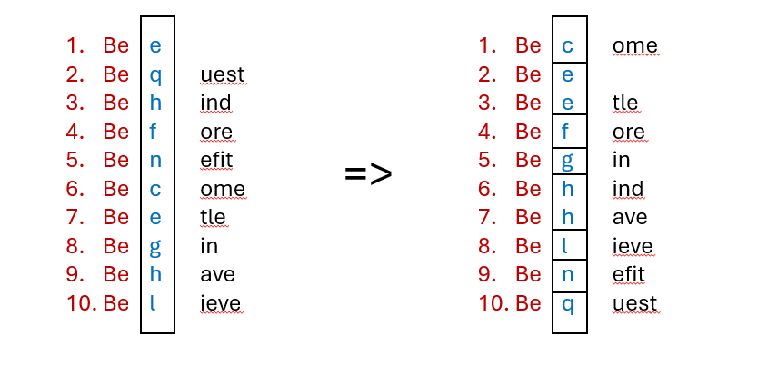

# MSD Radix Sort

**MSD Radix Sort** — это алгоритм поразрядной сортировки, который начинает обработку чисел со старшего значащего бита (Most Significant Digit).
([Видео с полным объясненим сортировки MSD Radix Sort](https://youtu.be/motzWpLeDlM?si=Ujs4VqNs1NmaNTv2))

## Принцип работы алгоритма

1. **Разделение по битам**: Алгоритм проверяет значения битов, начиная со старшего разряда
2. **Рекурсивная сортировка**: Числа разделяются на группы по значению текущего бита и сортируются рекурсивно
3. **Базовый случай**: Рекурсия прекращается когда:
   - Остался 0 или 1 элемент
   - Обработаны все биты числа

## Основные операции и их сложность

### Разделение элементов

Используется алгоритм `std::partition`, который делит элементы на две группы:
- Элементы с 0 в текущем бите
- Элементы с 1 в текущем бите

### Рекурсивная обработка

Алгоритм рекурсивно применяется к обеим группам для следующего бита. Глубина рекурсии равна количеству бит в числе.

**Сложность: O(n*w)** (где w - количество бит)

### Общая сложность

В среднем случае алгоритм демонстрирует линейную производительность, но в худшем случае может деградировать.

**Лучший случай: O(n)**
**Худший случай: O(n * w)**

### Вывод

Разделение | Рекурсия | Общая
---------- | -------- | --------
O(n)       | O(w)     | O(n * w)

## Особенности реализации

1. **Побитовая обработка**: Работает с любыми целочисленными типами
2. **Обработка знака**: Особый случай для старшего (знакового) бита
3. **Использование STL**: Применяет `std::partition` для эффективного разделения

## Область применения

MSD Radix Sort особенно эффективен для:
- Сортировки больших целочисленных массивов
- Данных с фиксированной длиной ключей
- Ситуаций, где требуется стабильная сортировка без сравнений
- Обработки данных с ограниченным диапазоном значений

## Сборка и запуск проекта 
1. `mkdir build && cd build`
2. `cmake ..`
3. `make`