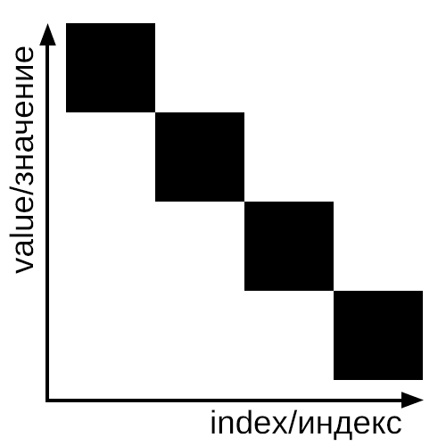

# Monkey Sort (BogoSort)

**Monkey Sort (также известный как BogoSort, StupidSort или ShotgunSort)** — это намеренно неэффективный алгоритм сортировки, основанный на принципе генерации случайных перестановок. Название происходит от гипотетической ситуации, где бесконечное количество обезьян случайным образом печатают на клавиатурах — теоретически они могут случайно написать отсортированную последовательность.

## 🔍Визуализация работы алгоритма

## Формула для расчета среднего времени работы алгоритма:
$$
O\left(n\cdot \sum _{i=1}^{\infty }{\frac {i}{n!}}\cdot \left(1-{\frac {1}{n!}}\right)^{i-1}\right)=O(n\cdot n!).
$$
## 📊Алгоритм работает следующим образом:

1) Проверяет, отсортирован ли массив.
2) Если нет — случайным образом перемешивает элементы.
3) Повторяет процесс до тех пор, пока массив не окажется отсортированным.

## Основные характеристики алгоритма

### 💻Производительность

При прохождении цикла один раз в секунду сортировка в среднем может занять:

Кол-во элементов  | Среднее время
----------------------------------
       1	    |    1 с
       2	    |    4 с
       3	    |    18 с
       4	    |    96 с
       5	    |    10 мин
       6	    |    1,2 ч
       7	    |    9,8 ч
       8	    |    3,7 сут
       9	    |    37,8 сут
       10	    |    1,15 лет
       11	    |    13,9 лет
       12         |    182 года

**⚖️Временная сложность**
-----------------------------------------------------------
Сложность | Лучший случай |	Средний случай    | Худший случай
----------|---------------|-------------------|--------------
Время	   |     O(n)	     |    O(n*n!)	    |       ∞

### Особенности

1) ⚠️Нестабильный алгоритм (не сохраняет порядок равных элементов)

2) ⚠️Неэффективен на практике (используется только в образовательных целях)

3) ⚠️Теоретически может никогда не завершиться (но вероятность стремится к нулю)

### 💻Реализованные функции

isSorted<T>(const std::vector<T>& arr)

* Проверяет, отсортирован ли массив.
* Сложность: O(n)

shuffleArray<T>(std::vector<T>& arr)

* Случайным образом перемешивает элементы массива.
* Сложность: O(n)

MonkeySort<T>(std::vector<T>& arr)

* Основная функция сортировки. Повторяет перемешивание до получения отсортированного массива.
* Сложность: см. таблицу выше

### 🧪Тестирование

**Реализованы следующие тесты:**

1) Сортировка пустого вектора

2) Сортировка вектора с одним элементом

3) Сортировка уже отсортированного вектора

4) Сортировка большого неотсортированного вектора

### Когда использовать? (НИКОГДА)

Не используйте этот алгоритм в реальных проектах!
MonkeySort представляет исключительно академический интерес и демонстрирует:

* ✅Важность выбора правильного алгоритма сортировки

* ✅Пример одного из худших возможных алгоритмов

* ✅Основные принципы работы алгоритмов сортировки

## 🛠Инструкция по сборке

### Сборка проекта (Linux/macOS)

- cd MonkeySort
- Создание директории для сборки: 1 шаг: mkdir build 2 шаг: build
- Генерация Makefile: cmake ..
- Сборка проекта: make
- Запуск тестов: ./MonkeySortTests

### Сборка проекта (Windows)

Клонирование репозитория
- git clone https://github.com/yourusername/MonkeySort.git
- cd MonkeySort
- Создание директории для сборки: 1 шаг: mkdir build 2 шаг: build
- Генерация проекта Visual Studio: cmake -G "Visual Studio 17 2022" ..
- Сборка в конфигурации Release: cmake --build . --config Release
- Запуск тестов: .\Release\MonkeySortTests.exe

### Требования:

- Компилятор C++17 (g++ 7+/clang++ 5+/MSVC 19.14+)
- CMake 3.12+
- Тестовая библиотека: Google Test