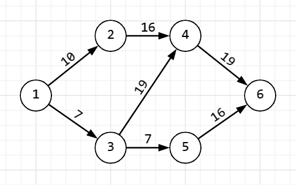
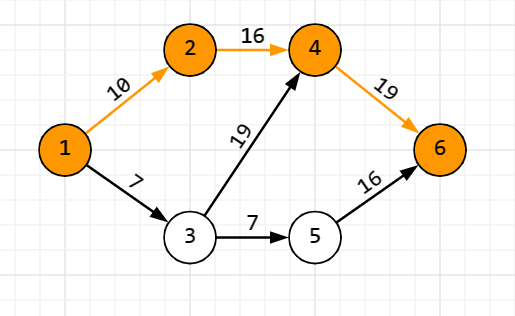
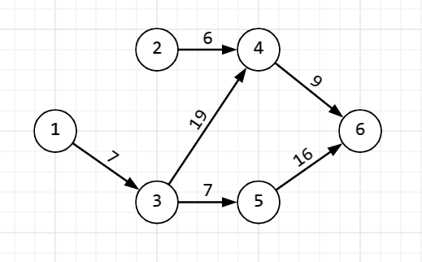
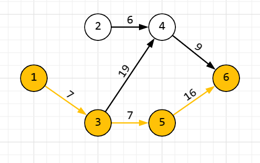
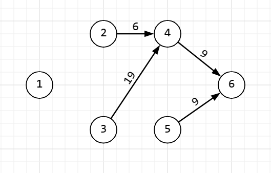

# Алгоритм Форда-Фалкерсона

**Алгоритм Форда-Фалкерсона** - алгоритм для нахождения максимального потока в сети.
  Необходимо представить сеть в виде графа, где вершины - это узлы сети, а ребра - это каналы связи между узлами. Каждое ребро имеет пропускную способность.

  Введем некоторые определения:

__Сеть__ - связный ориентированный граф

__Исток__ - начальная точка 

__Сток__ - конечная точка 

__Поток__ - пересылка некоторых объектов из одной вершины графа в другую по направлению дуги (например: поток в трубе 5 литров)

## Алгоритм

Необходимо представить сеть в виде ориентированного графа, где вершины - это узлы сети, а ребра - это каналы связи между узлами. Каждое ребро имеет пропускную способность, которая ограничивает количество данных, которые могут пройти через это ребро. 

Порядок действий:

1. Обойти граф от начальной вершины до конечной
2. Найти минимальный вес ребра на этом пути
3. Запомнить минимальный вес
4. Отнять у каждого ребра на данном пути найденный минимальный вес
5. Ребра, у которых вес стал нулевым, убрать
6. Повторить до момента, когда путей от начального узла до конечного не останется
7. Просуммировать все найденные минимальные веса

Эта сумма и будет максимальным потоком в сети. Рассмотрим работу данного алгоритма на примере.

<u> Пример: </u>

Имеется следующий ориентированный граф, в котором вес ребра обозначает пропускную способность между вершинами. Нужно найти максимальный поток, который можно пропустить из истока 1 в сток 6.

Находим произвольный путь

Минимальный вес ребра на заданном пути: __min1__ = 10

Вычитаем min1 из всех ребер и удалем ребра с нулевым весом на данном пути

Находим следующий путь (любой корректный)

Минимальный вес ребра на заданном пути: __min2__ = 7

Вычитаем min2 из всех ребер и удалем ребра с нулевым весом на данном пути

Методом пристального взгляда заметим, что путей из истока 1 в сток 6 больше не осталось

Заключительным этапом будет вычисление суммы найденных минимальных весов __minSum__ = __min1__ + __min2__ = 10 + 7 = 17

Ответ: Максимальный поток в сети = 17

## Основные операции и их сложность

На каждом шаге алгоритм добавляет поток увеличивающего пути к уже имеющемуся потоку. Следовательно, на каждом шаге алгоритм увеличивает поток по крайней мере на единицу, следовательно, он сойдётся не более чем за  __O(f)__ шагов, где f — максимальный поток в графе. Можно выполнить каждый шаг за время __O(E)__, где E - число рёбер в графе. Тогда __сложность алгоритма: O(Ef).__
