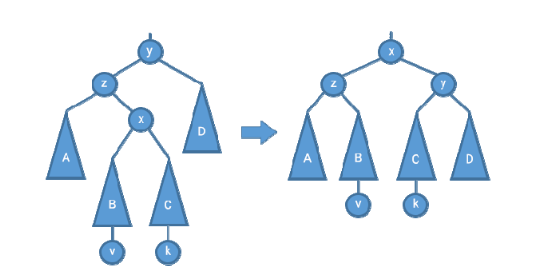

# AVL-дерево
Для начала введем следующие определения:

**Высота двоичного дерева Т** - длина самого длинного пути от корня к листу(высотой пустого деревья по орпедлению будем считать -1, а высота дерева с единственным узлом равна 0).

**Баланс дерева Т** - bal(T) разность высот его левого Tl и правого Tr поддеревьев: **bal(T)=h(Tl) – h(Tr)**.

**AVL-дерево** — это сбалансированное двоичное дерево поиска, в котором выполняются следующие два **свойства**:

**1.|bal(T)| <= 1**

**2.Два поддерева Tl и Tr корня дерева T сбалансированы по высоте.**

AVL-деревья названы по первым буквам фамилий их изобретателей, Г. М. Адельсона-Вельского и Е. М. Ландиса, которые впервые предложили использовать AVL-деревья в 1962 году.

## Бинарное дерево поиска в сравнении с AVL-деревом

## Для чего нужны АВЛ-деревья :

1. Для хранения данных. Эта структура позволяет хранить информацию в «узлах» дерева и перемещаться по ней с помощью путей, которые соединяют между собой узлы. Благодаря особому алгоритму данные хранятся относительно эффективно и с ними довольно удобно работать. Мы подробнее поговорим об этом ниже.

2. Для поисковых алгоритмов. АВЛ-деревья и бинарные деревья поиска в принципе — важная составная часть разнообразных алгоритмов поиска информации. Их применяют при построении поисковых систем и интеллектуальных сервисов.

3. Для программных проверок. АВЛ-дерево может использоваться для решения некоторых стандартных задач, например для быстрой проверки существования элемента в структуре.

    И многого другого

**Рассмотрим вспомогательные операции AVL-дерева**

## Вспомогательные операции

### Балансировка дерева

В процессе добавления или удаления узлов в AVL-дереве возможно возникновение ситуации, когда баланс некоторых узлов оказывается равными 2 или -2, т.е. возникает разбалансировка поддерева. Для того, чтобы дерево оставалось сбалансированным применяются повороты вокруг тех или иных узлов дерева(ниже представлены простые повороты вокруг узла p)

Рассмотрим случай, когда **баланс** некоторога узла p = -2, т.е возникает разбалансировка (обратный случай является симметричным и реализуется аналогично).

В данной ситуации возможно два решения :

1. Простой поворот влево(вправо) выполняется когда баланс правого сына узла p <= 0(баланс левого сына узла p => 0)

    

2. Бывают такие случаи, когда баланс правого сына узла p > 0, то одного левого поворота не хватит.В таких случая выполняется большой поворот влево вокруг этого узла = правый поворот вокруг правого сына этого узла и левый поворот вокруг p. Для большого поворота вправо аналогично(только баланс левого сына узла p < 0) - левый поворот относительно левого сына этого узла и правый поворот вокруг узла p.()

    

    

Эти операции не зависят от размера AVL-дерева

## Основные операции и их сложность

### Поиск

Алгоритм поиска в AVL-дереве реализуется аналогично поиску в бинарном дереве поиска.

**Следовательно сложность: O(h), где h=0(log(n)) - высота дерева**

### Вставка

Алгоритм вставки аналогичен вставке в бинароное дерево поиска с применением балансировки, т.е. спускаемся вниз по дереву, выбирая направление движения - влево, при значении ключа меньше, чем текущущий узел, и вправо при большем значении. При выходе из рекурсии вызывается балансировка(которая была описана ранее). 

Так как в процессе добавления вершины мы рассматриваем не более, чем O(h) вершин дерева, и для каждой запускаем балансировку не более одного раза, то суммарное количество операций при включении новой вершины в дерево составляет O(log(n)) операций.

**Следовательно сложность: O(log(n))**

### Удаление

Опять же алгоритм аналогичен удалению узла из бинароного дерева поиска с применением балансировки.

Если удаляемый узел:
1. является листом (т.е. не имеет сыновей), он удаляется и далее следует процесс балансировки;

2. имеет одного сына, то уего отцауказатель на него меняется на указатель на его единственного сына, а сам узел удаляется;

3. имеет двух сыновей, то в его левом поддереве ищется максимальный элемент (либо в правом –минимальный),значение удаляемого элемента заменяется значением этого найденного макси-мального  (минимального)  элемента.  Далее  происходит  удаление узла,  в  котором  был  найденмаксимальный(минимальный) элемент. Этотэлемент либо лист,либо имеет единственного сы-на, поэтому удаление происходит в соответствии с пунктами 1) или 2).

Сама операция удаления происходит за константное время, но сначала надо найти узел для удаления. Как мы выяснили выше это занимает линейное время.

**Следовательно сложность: O(log(n))**

### Вывод

Поиск  | Вставка | Удаление
------ | ------  | ------
O(log(n))   | O(log(n))    | O(log(n))
