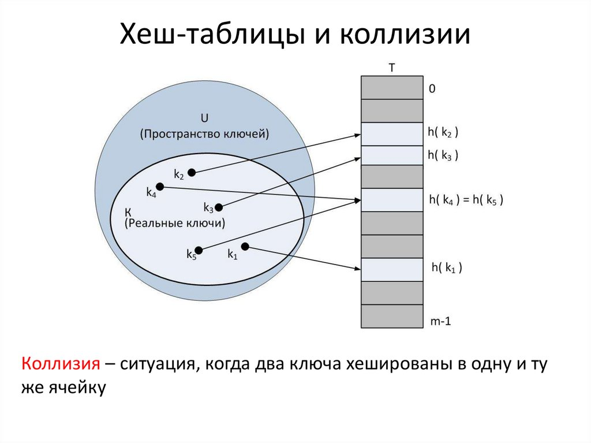

# Хэш-таблица (3 вида разрешений коллизий)

**Хэш-таблица** - это структура данных, которая хранит пары "ключ-значение" и обеспечивает быстрый доступ к значению по ключу. Она использует хэш-функцию для вычисления индекса (хэш-кода), по которому данные сохраняются в массиве.

## Схема хэш-таблицы:


## Основные понятия

**Хеширование** – эффективный способ представления данных, позволяющий быстро выполнять операции вставки, поиска и удаления элемента. 

Размещение элементов в таблице производится в соответствии с некоторой целочисленной функцией **H(k)** – **хеш-функцией**, определённой на множестве ключей K:

**H : K → {0, 1, 2, …, m – 1}.**

**Хэш-функция** — это алгоритм, который преобразует произвольные данные в фиксированное числовое значение (хэш-код) определённого размера.

## Требования предъявляемые к хэш-функциям:

1. Обеспечение **РАВНОМЕРНОСТИ**. То есть, для любого ключа k хеш-функция H(k) c равной вероятностью принимает любое из m возможных значений.

2. Обеспечение **ЭФФЕКТИВНОСТИ**. То есть значения хеш-функции должны быстро вычисляться.

3. Обеспечение **ДЕТЕРМИНИРОВАННОСТИ** - получения одинакового значения хеш-функции для одинаковых ключей и невозможность получения одинаковых значений хеш-функции для разных ключей.

4. Обеспечение **ОДНОНАПРАВЛЕННОСТИ** – невозможности получения исходного ключа по известному значению хеш-функции, за исключением попыток полного перебора («брутфорса», brute force).

5. Наличие **«ЛАВИННОГО ЭФФЕКТА»** – минимальное изменение в ключе должно приводить к кардинальному изменению в значении хеш-функции.

## Что же такое коллизия и как можно её избежать?



### В данной работе будут рассмотрены три метода решений коллизий:

- [Метод цепочек](#метод-цепочек)

- [Метод открытой адресации](#метод-открытой-адресации)

- [Идеальное хэширование](#идеальное-хэширование)

**Пример коллизии:**

Допустим нам необходимо разместить в хэш-таблицу элементы: **7 и 12**

Функция хэширования: 

**h(x)=x mod 5 (остаток от деления на 5)**

1. Вычислим хэш для 7:

**h(7) = 7 % 5 = 2 → число 7 должно попасть в ячейку 2**

2. Вычислим хэш для 12:

**h(12) = 12 % 5 = 2 → число 12 тоже должно попасть в ячейку 2**

**Результат:** Оба числа (7 и 12) претендуют на ячейку с индексом 2 → это **коллизия.**

# Три вида разрешений коллизий:

## Метод Цепочек<a name="метод-цепочек"></a>

**1. Основная идея**

Метод цепочек  — это способ разрешения коллизий в хеш-таблицах, при котором:

* Каждая ячейка таблицы содержит связный список элементов, имеющих одинаковый хеш.

* При коллизии новый элемент добавляется в начало соответствующего списка.

**2. Структура данных**

* **Хеш-таблица M** — массив размером m, где M [ j ] указывает на список элементов с хешом j.

* **Хеш-функция H(k)** — отображает ключ k в индекс {0, 1, ..., m-1}.

* **Коэффициент заполнения** α = n/m, где n — число элементов в таблице. 

**3. Пример работы:**

**Дана последовательность:**

[18, 14, 9, 20, 19, 12, 5, 27, 16, 34].

**Хеш-функция:**

**H(k) = k mod 11.**

* ### Вставка:

Очередной элемент вставляется в начало списка с целью минимизации времени вставки. Результат вставки элементов в пустую хеш-таблицу в соответствии со значениями  хеш-функции H(k) = k mod 11 приведён справа.

Элемент 18 размещается в списке 7, 14 – в списке 3, 9 и 20 – в списке 9 и т.д. В итоге хеш-таблица будет выглядеть так:

|Ключи:| 0 | 1 | 2 | 3 | 4 | 5 | 6 | 7 | 8 | 9 | 10|
|------|---|---|---|---|---|---|---|---|---|---|---|
|Эл-ты:|   |34 |   |14 |   |16 |   |18 |19 |20 |   |
|      |   |12 |   |   |   |27 |   |   |   | 9 |   |
|      |   |   |   |   |   | 5 |   |   |   |   |   |

**Алгоритм:**

* Вычислить хеш: j = H(k).

* Добавить элемент в начало списка M[j] (операция за O(1)).

**Сложность:**

**Хеширование:** O(1).

**Вставка в начало списка:** O(1).

**Примечание:**
Если вставка происходит в конец списка, сложность остается O(1), если хранится указатель на хвост. В противном случае — O(α).

* ### Поиск элемента:

**Алгоритм:**

* Вычислить хеш: j = H(k).

* Пройти по списку M[j] и сравнить каждый элемент с ключом k.

* Если элемент найден — вернуть его, иначе — null.

**Сложность:**

**Средний случай** (успешный/неуспешный поиск):

O(1 + α), где α — средняя длина цепочки.

**Вычисление хеша:** O(1).

**Поиск в списке:** 

O(α) (при равномерном хешировании).

**Худший случай:** O(n),

-Если все элементы попали в одну цепочку (например, при плохой хеш-функции).

**Теоретическое обоснование:**

При равномерном хешировании средняя длина цепочки (α = n/m).

Для успешного поиска требуется проверить в среднем (1 + α/2) элементов (Теорема 3.4.4 - Учебное пособие).

Для неуспешного поиска — всю цепочку (α элементов) (Теорема 3.4.3 - Учебное пособие).

* ### Удаление:
**Алгоритм:**

* Вычислить хеш: j = H(k).

* Найти элемент в списке M[j] (поиск за O(α)).

* Удалить элемент из списка (если найден) за O(1).

**Сложность:**

**Средний случай:**

 O(1 + α) (поиск + удаление).

**Худший случай:**

 O(n) (если все элементы в одной цепочке)

 * ### Вывод:

| Операция | Средний случай (α = O(1)) |	Худший случай |
|----------|---------------------------|------------------|
|  Поиск   |     O(1 + α) → O(1)	   |       O(n)       |
| Вставка  |          O(1)	           |       O(1)       |
| Удаление |    O(1 + α) → O(1)	       |       O(n)       |


## Метод открытой адресации:<a name="метод-открытой-адресации"></a>

Метод **открытой адресации** (закрытого хеширования) разрешает коллизии путем поиска свободной ячейки внутри самой хеш-таблицы. Все элементы хранятся непосредственно в массиве M размером m, где m > n (число элементов).

**Ключевые особенности:**

* Нет связных списков — коллизии решаются через последовательность проб (*зондирование*).

* При удалении нельзя просто очищать ячейку (требуется маркировка DEL или перехеширование).

* Основные стратегии зондирования: линейное, двойное хеширование. 

В данном примере будет рассмотрена реализация с **линейым зондированием**.

### Линейное зондирование:

**Функция зондирования:**

**P( k, i ) = ( H ( k ) + i ⋅ r ) mod m**

где:

* H(k) — исходный хеш,

* i — номер попытки (начинается с 0),

* r — шаг зондирования (обычно r = 1).

**Пример:**

Для последовательности:

[18, 14, 9, 20, 19, 12, 5, 27, 16, 34] и H (k) = k ⋅ mod 11:

18 → 7, 14 → 3, 9 → 9,

20 → 9 (коллизия) → следующая ячейка 10,

16 → 5 (коллизия с 5, 27) → после 7 проб попадает в 0.

**Итоговая таблица:**

| Индекс	| 0	| 1	| 2	| 3	| 4	| 5	| 6	| 7	| 8	| 9	| 10 |
|-----------|---|---|---|---|---|---|---|---|---|---|----|
|Значение	|16	|12	|34	|14	|EMP| 5 | 27| 18|19 |  9|20  |

* ### Поиск элемента:

**Алгоритм:**

1. Вычислить j = H(k).

2. Проверить M[j]:

* Если M[j] == k → успех.

* Если M[j] == EMPTY → неудача.

* Иначе проверить следующую ячейку P(k, i).

3. Повторять до нахождения k или EMPTY (максимум m попыток).

**Сложность:**

* Средний случай (успешный поиск):

 O(1/1-α), где α = n/m

* Худший случай: 

O(n) (все элементы в одном кластере).

**Теоретическое обоснование:** 

При равномерном хешировании среднее число проб:

* Для успешного поиска: 
1\2 ⋅ (1 + 1/(1+α))

* Для неуспешного поиска: 1\2 ⋅ (1 + 1/(1+α)^2)

* ### Вставка:

**Алгоритм:**

1. Вычислить j = H(k).

2. Если M[j] свободна (EMPTY/DEL) → записать k.

3. Иначе искать следующую ячейку P(k, i) до нахождения свободного места.

**Сложность:**

Аналогична поиску:

​ O(1/1-α) в среднем.

**Пример:**

Вставка 30 -> H(30) = 8:

M[8] занято (19) → проверяем M[9] (DEL) → записываем 30.

* ### Удаление элемента:

**Проблема:** Прямое удаление (EMPTY) ломает цепочки зондирования.

**Решение:**

1. **Метод перехеширования:**

* Удалить элемент, затем перехешировать все последующие в цепочке.

* Сложность: O(m) в худшем случае.

2. **Метод маркировки (DEL):**

* Заменить удаляемый элемент на DEL.

* При поиске DEL игнорируется, при вставке — перезаписывается.

* Сложность: O(1) на удаление + поиск за O(1/1-α). 

**Пример удаления 9:**

* Маркировка DEL в M[9] → таблица будет выглядеть так:

|...| 9	| 10 |...|
|---|---|----|---|
|...|DEL| 20 |...|

* ### Вывод:

| Операция | Средний случай (α < 1)	| Худший случай |
|----------|------------------------|---------------|
|Поиск	   |      O(1/1-α)          |      O(n)     |
|Вставка   |      O(1/1-α)          |      O(n)     |
|Удаление  |      O(1/1-α)          |      O(n)     |

## Идеальное хэширование: <a name="идеальное-хэширование"></a>

**Идеальное хеширование** — это метод построения хеш-таблицы, где для фиксированного набора ключей подбираются такие хеш-функции, что коллизии отсутствуют. Гарантирует поиск за O(1) в худшем случае.

**Ключевые особенности:**

1. Используется двухуровневая структура:

* Первичная хеш-функция распределяет ключи по слотам.

* Для слотов с коллизиями строятся вторичные хеш-таблицы с уникальными функциями.

2. Требует предварительного анализа ключей и подбора функций.

3. Не поддерживает динамические операции (вставку/удаление) без полной перестройки.

**Пример:**

Для ключей: [18, 14, 9, 20, 19, 12, 5, 27, 16, 34] 

**H(k) = (3k + 17) mod 101 mod 11:**

1. Первичное распределение:

* H(9)=0, H(20)=0 → коллизия → вторичная таблица S₀.  
* H(5)=10, H(27)=10, H(16)=10 → коллизия → S₁₀.  
* Остальные ключи (14, 18, 19, 12, 34) попадают в уникальные слоты.

2. Вторичные таблицы:

* S₀: [9, 20] с функцией H₀(k) = (7k + 15) mod 2.
* S₁₀: [5, 27, 16] с функцией H₁₀(k) = (9k + 13) mod 9.

* ### Поиск:

**Алгоритм:**

* Вычислить j = H(k) (первичный хеш).

* Если в слоте j один ключ → сравнить и вернуть результат.

* Иначе вычислить i = Hⱼ(k) (вторичный хеш) и проверить Sⱼ[i].

**Сложность:**

Всегда O(1):

* 1 обращение к первичной таблице.

* 1 обращение к вторичной (если есть коллизии).

**Пример поиска 27:**

* H(27) = 10 → слот 10 требует вторичной таблицы.

* H₁₀(27) = (9*27 + 13) mod 9 = 1 → S₁₀[1] = 27 (найден).

* ### Вставка:

*Особенность:*

* Идеальное хеширование не поддерживает динамическую вставку.

* Добавление нового ключа требует:

1. Пересчета всех хеш-функций.

2. Перестроения первичной и вторичных таблиц.

**Сложность:**

O(n²) в худшем случае (подбор новых функций для всех ключей).

* ### Удаление:
**Особенность:**

* Удаление нарушает уникальность хеш-функций.

* Требует полной перестройки таблицы (аналогично вставке).

**Сложность:**

O(n²) - (как и для вставки).


### Сравнение с другими методами:

| Критерий|	Идеальное хеширование |Метод цепочек  |	Открытая адресация|
|---------|-----------------------|---------------|-------------------|
|Поиск	  |O(1) (гарантировано)   |	O(1 + α)      |	O(1/(1 - α))      |
|Вставка  |	Не поддерживается	  |   O(1)	      |  O(1/(1 - α))     |
|Удаление |    Не поддерживается  | O(1 + α)      |	O(1/(1 - α))      |
|Память	  |O(n) (высокие константы)|    O(n + m)  |     O(m)          |
|Динамичность|	       Нет        |	      Да	  |       Да          |

* ### Вывод:

**Применение:**
* Статические данные (ключевые слова языков, базы данных).

* Задачи, где критичен гарантированный O(1) для поиска.

**Недостатки:**

* Невозможность обновления данных.

* Высокие накладные расходы на построение.

**Итог: Идеальное хеширование** — это «идеальный» метод для статических наборов, но непригодный для динамических структур.

# Другие источники: 

**1. "Учебное пособие по МП" - Петухова Н.Н., Демидова А.Н. :** 

*Расположение файла:* (.fonts\Учебное пособие по МП Петухова Н.Н., Демидова А.Н..doc)

**2. Видеоролик по хеш-таблицам:** 

*Ссылка:* https://vkvideo.ru/video-139172865_456239139

# Инструкция по сборке и запуску проекта:

## Требования:
- Компилятор C++17 (g++ 7+/clang++ 5+/MSVC 19.14+)
- CMake 3.12+
- Тестовая библиотека: Google Test

## Сборка проекта (Linux/macOS)
``` bash
cd HashTable

# Создание директории для сборки
mkdir build
cd build

# Генерация Makefile
cmake ..

# Сборка проекта
make

# Запуск тестов
./HashTableTests
```
