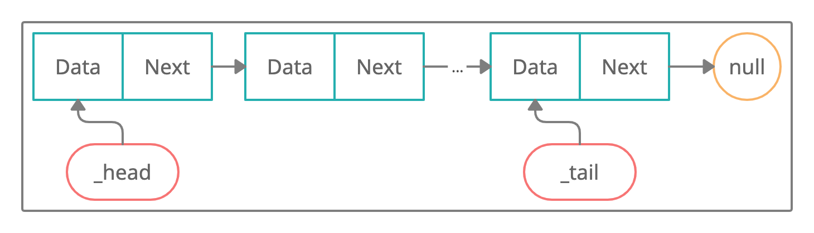

# Связный список

**Связный список** — это динамическая структура данных, состоящая из узлов, которые содержат в себе в классическом варианте два значения: первое — это какие-либо данные (этими данными может быть что угодно: обычная переменная, объект класса и так далее), а второе — это указатель на следующий узел в списке (не зря же список является связанным).

## Типичная схема связного списка

## Основные операции и их сложность

### Поиск

В связном списке мы знаем только указатели на начальный и последний элемент списка. Поэтому чтобы найти элемент мы должны последовательно двигаться по узлам списка и сравнивать их ключи с искомым.

**Следовательно сложность: O(n)**

### Вставка

Как правило, элементы в связном списке добавляются в конец. Так как мы храним указатель на последний элемент списка - сможем его добавить просто создав ячейку и задав соответсвующие указатели на созданную ячейку.

**Следовательно сложность: O(1) + O(1) = O(1)**

### Удаление

Сама операция удаления происходит за константное время, но сначала надо найти узел для удаления. Как мы выяснили выше это занимает линейное время.

**Следовательно сложность: O(1) + O(n) = O(n)**

### Вывод

Поиск  | Вставка | Удаление
------ | ------  | ------
O(n)   | O(1)    | O(n)
