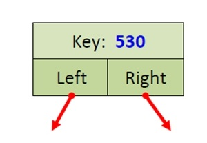

# **Бинарное дерево поиска**

**Бинарное дерево** (Binary tree) — это дерево (структура данных), в которой каждый узел (node) имеет не более двух дочерних узлов (child nodes).

### Некоторые определения:
 * **Узел (node)** - структура, реализующая принцип бинарного дерева и являющаяся его основной частью.
 * **Корень бинарного дерева** - узел, находяшийся на самом верхнем уровне дерева и не являющийся чьим-либо потомком.
 * **Лист (leaf)** - узел, находящийся на самом нижнем уровне дерева, не имеющий потомков.
 * **Дочерний узел (потомок)** - узел, отходящий от другого узла.
 * **Родительский узел (предок)** - узел, от которого отходит другой узел.
 * **Высота(глубина) дерева (*h*)** - максимальное количество узлов от корня к листу.

## Типичная схема бинарного дерева поиска

**Бинарное дерево поиска** (Binary search tree, BST) —  это двоичное дерево, в котором: 
1) Оба поддерева — левое и правое — являются двоичными деревьями поиска;
2) У всех узлов левого поддерева произвольного узла X значения ключей данных меньше либо равны, нежели значение ключа данных самого узла X;
3) У всех узлов правого поддерева произвольного узла X значения ключей данных больше, нежели значение ключа данных самого узла X.

## Типичная схема **узла** бинарного дерева поиска

### Добавим некотрые определения:
 * **Ключ (key)** - поле узла (составная часть), являющийся уникальным идентификатором узла.
 * **Указатель (левый/правый)** - поле узла (составная часть), реализующее связь одного узла с другим.

## Типичная схема бинарного дерева поиска:

### *Примечание*:
* *В некотрых вариациях бинарного дерева поиска, в узле, может, помимо ключа, хранится еще и значение (value). Это сделано для оптимизации работы дерева со строками.*
* *Бинарные деревья без поля value также могут работать со строками, но для этого нужны доопределения операции сравнения строк друг с другом на уникальность. (т.е. ключом каждого узла дерева будет не число, а строка)*

## Основные операции:

1) INSERT(K) — добавление в дерево узла с ключом (key), key = K.
2) FIND(K) — поиск узла, с ключом (key), key = K.
3) REMOVE(K) — удаление узла, с ключом (key), key = K.

### Вставка (Insert):
* При добавлении узла необходимо, последовательно сравнивая искомый ключ с ключом в узле, спуститься по правому(левому) указателю к дочернему узлу (начиная с корня дерева) до листа – это требует количества операций cравнения порядка высоты h дерева;
* Поиск листа – O(h), создание элемен и корректировка указателей – O(1)

  **Следовательно сложность: O(h) + O(1) = O(h)**

### Поиск (Find):
При поиске ключа key необходимо последовательно сравнивать искомый ключ с ключом в узле (начиная с корня):
* если ключ текущего узла равен key - вернуть указатель на текущий элемент
* если ключ текущего узла меньше key - спуститься в левое поддерево (по левому указателю к дочернему узлу)
* если ключ текущего узла больше key - спуститься в правое поддерево (по правому указателю к дочернему узлу)

   **Следовательно сложность: О(h)**

### Удаление (Remove)
* Найти узел по ключу, если он существует (алгоритм аналогичен поиску ключа)
* По нахождению искомого узла, рассмотреть 3 случая:
    1) Если обоих детей нет, то удаляем текущий узел и обнуляем ссылку на него у родительского узла;

        

    2) Если одного из детей нет, то родительский указатель на текущий узел устанавливаем на непустой дочерний узел;

        

    3) Eсли присутсвуют оба ребенка, то необходимо найти узел с минимальным ключом в правом поддерева искомого узла и его поставить на место удаляемого узла.

        

    **Следовательно сложность: O(h)**

---
#  **Вывод**

*  ## Преимущество:
    Основным преимуществом двоичного дерева поиска является эффективное добавление и удаление узлов, поддержание отсортированного порядка и относительно быстрый доступ к узлам.

* ## Применение:
    Двоичное дерево поиска применяется для построения более абстрактных структур, таких, как множества.

* ## Сложность:
    1) Если считать по высоте h дерева:
        * Поиск листа – O(h)
        * Cоздание узла и корректировка указателей – O(1)
        
        **Следовательно общая сложность равна O(h)**

    2) Если считать для общего количества элементов n в дереве:

            Вообще говоря: log2 ⩽ h ⩽ n
        
        | ПАРАМЕТРЫ       | *Лучший случай*  | *Худший случай* |
        | --------------- | :-------------: | :-------------: |
        | *расход памяти* | O(log n)        |  O(n)           |
        | *Вставка*       | O(log n)        |  O(n)           |
        | *Поиск*         | O(log n)        |  O(n)           |
        | *Удаление*      | O(log n)        |  O(n)           |

        ### **Замечание:**

         

        Худший случай  *O(n)* может наступить в том и только том случае, когда вставка ключей в дерево происходит в сортированной последовательности, при этом дерево выраждаетя в **связный список**. Для решения этой проблемы существуют другие виды деревьев, например [AVL](https://habr.com/ru/articles/150732/) .

       
## Выполнение кода
 Для запуска кода используйте команду:

`cmake -S . -B build && cmake --build "build" && ./build/BSTTests`
