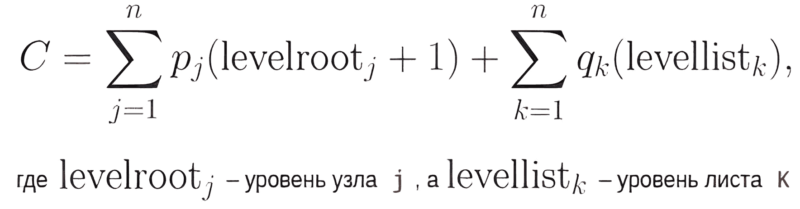
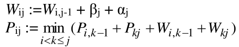
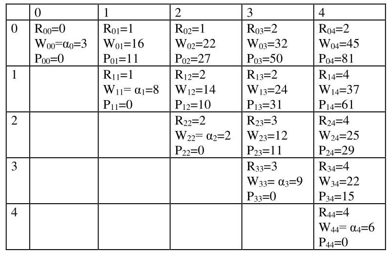

# Долгосрочное домашнее задание

## **Теория необходимая для работы**

[Пояснительное видео](https://youtu.be/JFrEE8fpC9g)

**Оптимальное бинарное дерево поиска** – это бинарное дерево поиска, построенное в расчете на обеспечение максимальной производительности при заданном распределении вероятностей поиска требуемых данных. Больше информации [тут](./data/optimal.pdf).

**Временная сложность** построения OBST равна O(n3), где n - количество ключей. Однако, с некоторыми оптимизациями, мы можем уменьшить временную сложность до O(n2). После построения OBST временная сложность поиска ключа равна O (log n), такая же, как для обычного бинарного дерева поиска.

**Важный момент**, что в отличии от других деревьев поиска в OBST нет возможнсоти вставки элемента, так как дерево строится по изначальному массиву вероятностей.

Назовем среднее число сравнений **ценой дерева**, а дерево с минимальной
ценой – **оптимальным**.

**Формула для нахождения цены дерева**

Где:

**n** - общее **количество записей**;

**pi** – **вероятность** того, что аргументом поиска является **Ki** элемент;

**qi** – **вероятность** того, что аргумент поиска лежит между вершинами **Ki** и **Ki+1** ;

**q0** – **вероятность** того, что аргумент поиска меньше, чем значение элемента **K1** ;

**qn** – **вероятность** того, что аргумент поиска больше, чем **Kn**.

Для построения оптимального дерева необходимо **построить матрицу** с соответствующими значениями вероятностей и заполнить ее с помощью рекурсивных формул приведенных далее.

**Рекурсивные формулы для значения**

Где:

**Rij** – **номер корня** оптимального дерева на последовательности весов **αi, βi+1, αi+1, …,βj, αj**;

**Wij** – **сумма весов** **αi + βi+1 + … + βj + αj**;

**Pij** – **взвешенная длина пути** оптимального дерева на последовательности весов **αi, βi+1, αi+1,…,βj, αj**;

**α** - **вероятность** того, что аргументом поиска является **Ki** элемент;

**β** - **вероятность** того, что аргумент поиска лежит между вершинами **Ki** и **Ki+1**.

**Пример необходимой матрицы**

Далее из матрицы строится дерево поиска, по уже известным нам алгоритмам построения дерева, **принимая за корень R(0, n)**

**Алгоритм** такой же как и у обычного дерева поиска:

    Оба поддерева — левое и правое — являются двоичными деревьями поиска;

    У всех узлов левого поддерева произвольного узла X значения ключей данных меньше либо равны, нежели значение ключа данных самого узла X;

    У всех узлов правого поддерева произвольного узла X значения ключей данных больше, нежели значение ключа данных самого узла X.

    Дерево состоит из узлов (вершин) — записей вида (data, left, right), где data — некоторые данные, привязанные к узлу, left и right — ссылки на узлы, являющиеся детьми данного узла — левый и правый сыновья соответственно. Для оптимизации алгоритмов конкретные реализации предполагают также определения поля parent в каждом узле (кроме корневого) — ссылки на родительский элемент.

    Данные (data) обладают ключом (key), на котором определена операция сравнения «меньше». В конкретных реализациях это может быть пара (key, value) — (ключ и значение), или ссылка на такую пару, или простое определение операции сравнения на необходимой структуре данных или ссылке на неё.

    Для любого узла X выполняются свойства дерева поиска: key[left[X]] < key[X] ≤ key[right[X]], то есть ключи данных родительского узла больше ключей данных левого сына и нестрого меньше ключей данных правого.

## **Основные функции**

### **CreateEmptyMatrix**

Создание нулевой матрицы заданных размеров, для будущего заполнения ее переданными значениями.

### **MainDiagonal**

Заполнение главной диагонали матрицы переданными вероятностями.
Пример на стр.5 [пособия](./data/optimal.pdf).

### **FillMatrix**

Полное заполнение матрицы и расчет значений в соответствии рекурсивному алгоритму приведенному выше.
Пример на стр.6 [пособия](./data/optimal.pdf).

### **MatrixToTree**

Преобразование матрицы в оптимальное дерево поиска.
Пример на стр.7-8 [пособия](./data/optimal.pdf).

### **Search**

Поиск элемента. Чтобы найти элемент мы должны последовательно двигаться по узлам дерева и сравнивать их ключи с искомым.

### **RoundLrootR, LoundLrootL**

Обход дерева(правый и левый).
