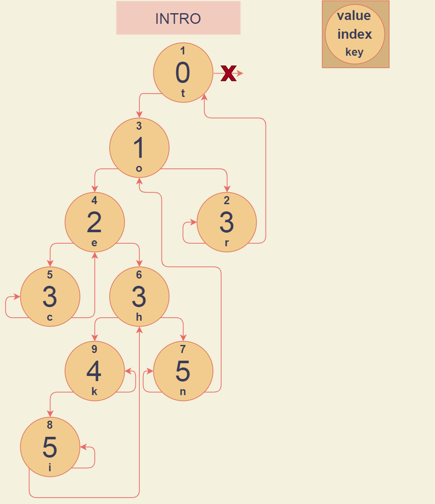

# Patricia-дерево
 
В 1968 г. Д. Р. Моррисон (Donald R. Morrison) предложил способ решения перечисленных проблем. Им разработан алгоритм, который
он назвал **Patricia** (*practical algorithm to retrieve information coded in alohanumeric* - практический алгоритм получения информации, за-кодированной алфавитно-цифровыми символами). 

Двоичные деревья, которые использует алгоритм в процессе работы, называют **patricia**-деревьями. Они содержат **n** ключей в **n** узлах и требуют выполнения всего лишь около **log(n)**, сравнений разрядов и одного сравнения полного ключа при поиске. Число операций при этом не зависит от длины ключа. **Patricia**-деревья можно использовать при работе с ключами переменой длины.

При использовании **patricia**-деревьев ключи хранятся во внутренних узлах. Каждый внутренний узел кроме значения ключа содержит номер проверяемого разряда для выбора дальнейшето пути. Это позволяет сократить число внутренних узлов, в которых не происходит ветвления (ключи имеют одинаковые значения разрядов). Обход дерева выполняется в соответствии со значениями указанных разрядов искомого ключа. В дереве отсутствуют NULL-связи, они заменяются указателями на соответствующие внутренние узлы.

Итак в **patricia**-деревьях:
* каждая вершина имеет:
    - Ключ(_key_)
    - Значение(_value_)
    - Индекс бита, который нужно проверять для поиска(_index_)
    - Указатели на правую и левую вершину(_*right_, _*left_)
* нет **NULL**-связей;
* узлы в дереве одного типа;
* корневой узел всегда содержит ключ, все разряды которого равны 0;
* проверяется не текущий разряд искомого ключа, а разряд, номер которого указан в узле;
* поиск завершается в случае, если номер проверяемого разряда не увеличивается (при перемещении вверх, к уже пройденному узлу, значение ключа в котором - ближайшее к искомому).

## Представление **Patricia**-дерева

## Для чего нужны **Patricia**-деревья :

1. Для хранения данных. Эта структура позволяет хранить информацию в «узлах» дерева и перемещаться по ней с помощью путей, которые соединяют между собой узлы. Благодаря особому алгоритму данные хранятся относительно эффективно и с ними довольно удобно работать.

2. Для поисковых алгоритмов. **Patricia**-деревья — важная составная часть разнообразных алгоритмов поиска информации. Их применяют при построении поисковых систем и интеллектуальных сервисов.

3. Для программных проверок. **Patirica**-дерево может использоваться для решения некоторых стандартных задач, например для быстрой проверки существования элемента в структуре.

## Основные операции и их сложность

### Поиск

Алгоритм поиска в **Patricia**-дереве схож с поиском в _trie_-дереве, за исключением следующих особенностей: нет явных пустых ссылок, в ключе проверяется не следующий разряд, а указанный, и поиск завершается сравнением ключа в точке, где происходит переход вверх по дереву. Указывает ли ссылка вверх, проверить легко, т.к. индексы разрядов в узлах (по определению) увеличиваются по мере перемещения вниз по дереву. 

Поиск начинается с корня и проходит вниз по дереву, используя в каждом узле индекс разряда для определения проверяемого разряда в искомом ключе — если этот разряд равен 1, выполняется переход вправо, а если 0 — влево.

При встрече первой ссылки, указывающей вверх, искомый ключ сравнивается с ключом в указанном узле, т.к. это единственный ключ в дереве, который может быть равен искомому ключу, и поиск прекращается.

**Следовательно сложность: O(l(key)), где l(key) - длина ключа**

### Вставка

Опишем алгоритм вставки элемента _х_ в **patricia**-дерево. Вставка происходит в случае неудачного поиска, в результате которого текущий узел содержит ключ _кеу_. Ищется номер _d_ самого левого разряда, в котором отличаются искомый ключ _х_ и ключ _кеу_. Затем, начиная с корня, снова идем по пути поиска и сравниваем номера проверяемых разрядов в узлах со значением _d_. Если при этом из узла _у_ мы попадаем в узел _z_, в котором значение проверяемого разряда больше, чем , новый узел необходимо вставить между узлами _у_ и _z_. В случае, если перемещение происходит вверх по дереву из узла _у_ в узел _z_ (т.е. поиск, по аналогии с завершился в листе»), новый узел неооходимо также вставить между узлами _y_ и _z_.

Новый узел будет содержать ключ _x_, номер проверяемого разряда, равный _d_, и левый и правый указатели. В случае, если _d_-й разряд _x_ равен 0, левый указатель ссылается на вновь вставленный узел, а правый - на узел _z_. Если _d_-й разряд _x_ равен 1, наоборот, правый указатель ссылается на вновь вставленный узел, а левый - на узел _z_.

**Следовательно сложность: O(l(key))**

### Вывод

Поиск  | Вставка 
------ | ------  
O(l(key))   | O(l(key))

## Выполнение кода
 Для запуска кода используйте команду:

`cmake -S . -B build && cmake --build "build" && ./build/PatriciaTreeTests`
