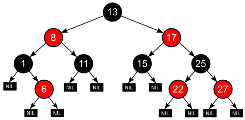
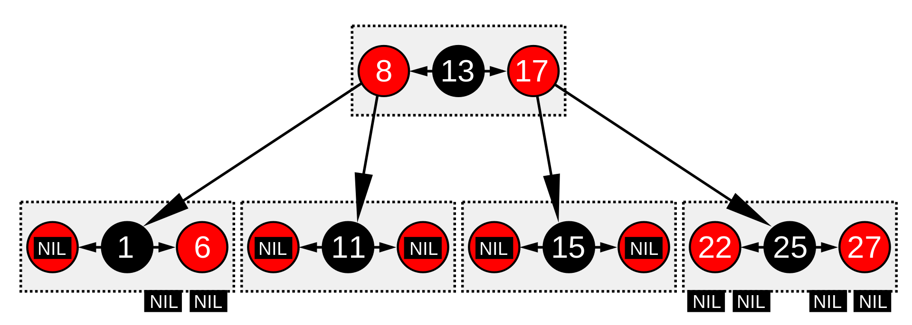
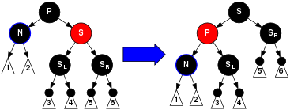

# Красно-чёрное дерево

**Красно-чёрное дерево** — один из видов самобалансирующихся двоичных деревьев поиска, гарантирующих логарифмический рост высоты дерева от числа узлов и позволяющее быстро выполнять основные операции дерева поиска: добавление, удаление и поиск узла. Сбалансированность достигается за счёт введения дополнительного атрибута узла дерева — «цвета». Этот атрибут может принимать одно из двух возможных значений — «чёрный» или «красный».
Основные понятия и свойства:
1. Узел может быть либо красным, либо чёрным и имеет ровно двух потомков.

Уточнение про потомков узлов.
По умолчанию у узла есть NIL(Nullptr) указатели на левого и правого потомка, которые считаются чёрными узлами согласно пункту 3.

2. Корень — как правило чёрный.
3. Все листья, не содержащие данные — чёрные.
4. Оба потомка каждого красного узла — чёрные.
5. Любой простой путь от узла-предка до листового узла-потомка содержит одинаковое число чёрных узлов.
6. Черной высотой _bh_ узла _U_ называют количество чёрных узлов от _U_ до любого листа в поддереве.
7. Красный узел не имеет красного потомка.

## Схема красно-чёрного дерева

## Про использование

Красно-чёрные деревья гарантируют время вставки, удаления и поиска в худшем случае за _O(log N)_. Это делает их незаменимыми в чувствительных ко времени приложениях, а также ценными эллементами для других структур данных, которые обеспечивают гарантии наихудшего случая. Например, многие структуры данных, используемые в вычислительной геометрии, могут быть основаны на красно-черных деревьях, а планировщик Completely Fair Scheduler, используемый в текущих ядрах Linux в реализации системных вызовов epoll, использует красно-чёрные деревья. Они также используются в библиотечных функциях С++, таких как map, multiset и multimap. Также красные-чёрные деревья используются в реализации алгоритмов на графах, таких как алгоритм Дейкстры поиска кратчайшего пути и алгоритм минимального остовного дерева Прима.

## Аналогия с B-Tree порядка 4
### Как выглядить дерево выше в реализации B-Tree

Красно-чёрное дерево схоже по структуре с B-деревом с параметром 4, в котором каждый узел может содержать от 1 до 3 значений и, соответственно, от 2 до 4 указателей на потомков. В таком В-дереве каждый узел будет содержать только одно значение, соответствующее значению чёрного узла красно-чёрного дерева с необязательным значениями до и/или после него в том же узле, оба из которых соответствуют эквивалентным красным узлам красно-чёрного дерева.

Один из способов увидеть эту эквивалентность - «переместить вверх» красные узлы в графическом представлении красно-черного дерева, чтобы они выровнялись по горизонтали со своим родительским черным узлом, создав вместе горизонтальный кластер. В B-дереве или в модифицированном графическом представлении красно-черного дерева все листовые узлы находятся на одной глубине.

Тогда красно-черное дерево структурно эквивалентно B-дереву порядка 4 с максимальной емкостью 3 значения.

Однако этот тип B-дерева является более общим, чем красно-черное дерево, поскольку допускает неоднозначность при преобразовании красно-черного дерева — несколько красно-черных деревьев могут быть получены из эквивалентного B-дерева порядка 4. Если кластер B-дерева содержит только 1 значение, оно минимальное, черное и имеет два дочерних указателя. Если кластер содержит 3 значения, то центральное значение будет черным, а каждое значение, хранящееся по его сторонам, будет красным. Однако если кластер содержит два значения, любое из них может стать черным узлом в красно-черном дереве (а другое будет красным).

Таким образом, B-дерево порядка 4 не даёт понять, какое из значений, содержащихся в каждом кластере, является корневым черным узлом для всего кластера и родителем других значений в том же кластере. 

Однако узлы B-дерева занимают меньше места, поскольку нам не нужно хранить атрибут цвета для каждого узла. Вместо этого мы должны знать, какой слот в векторе кластера используется.

Ту же аналогию можно провести с B-деревьями с большими порядками, которые могут быть структурно эквивалентны цветному бинарному дереву: вам просто нужно больше цветов. Предположим, что вы добавили синий, затем сине-красно-черное дерево, определенное как красно-черное дерево, но с дополнительным ограничением, заключающимся в том, что никакие два последовательных узла в иерархии не будут синими, а все синие узлы будут потомками красного узла, тогда оно становится эквивалентным B-дереву, кластеры которого будут иметь не более 7 значений следующих цветов: синий, красный, синий, черный, синий, красный, синий (Для каждого кластера будет не более 1 черного узла, 2 красных узлов и 4 синих узла).

## Вспомогательные операции
Т.к. операции вставки и удаления из дерева могут нарушить свойства 1-7, то введем вспомогательную операцию поворота вокруг узла.
### Левый и правый поворт вокруг узла

Треугольниками обозначаются поддеревья узлов.

## Основные операции и их сложность

Есть красно-черное дерево, черная высота равна _bh_(black height).
Если путь от корневого узла до листового содержит минимальное количество красных узлов (т.е. ноль), значит этот путь равен _bh_.
Если же путь содержит максимальное количество красных узлов, то этот путь будет равен _2bh_.
То есть, пути из корня к листьям могут различаться не более, чем вдвое (_h<=2log(N + 1)_, где h — высота поддерева), этого достаточно, чтобы время выполнения операций в таком дереве было _O(log N)_

### Поиск

В худшем случае при поиске нам необходимо дойти до листа дерева, его высота по свойствам гарантированно будет _O(log N)_, операции сравнения выполняются за _O(1)_, тогда получаем, что общая сложность _O(1)_*_(log N)_ = _O(log N)_

**Следовательно сложность: O(log N)**

### Вставка

Новый узел в красно-чёрное дерево добавляется на место одного из листьев, окрашивается в красный цвет и к нему прикрепляется два листа (так как листья являются абстракцией, не содержащей данных, их добавление не требует дополнительной операции). Что происходит дальше, зависит от цвета близлежащих узлов.

__Заметим:__
* Свойство 3 (Все листья чёрные) выполняется всегда.
* Свойство 4 (Оба потомка любого красного узла — чёрные) может нарушиться только при добавлении красного узла, при перекрашивании чёрного узла в красный или при повороте.
* Свойство 5 (Все пути от любого узла до листовых узлов содержат одинаковое число чёрных узлов) может нарушиться только при добавлении чёрного узла, перекрашивании красного узла в чёрный (или наоборот), или при повороте.

Аналогично нам гарантируется высота _O(log N)_, операции перекрашивания и поворота выполняются за _O(1)_, следовательно вставка также будет иметь сложность _O(1)_*_(log N)_ = _O(log N)_

**Следовательно сложность: O(log N)**

Введем обозначения

Буквой N будем обозначать текущий узел. Сначала это новый узел, который вставляется, но эта процедура может применяться рекурсивно к другим узлам (смотрите случай 3). P будем обозначать предка(родителя) N, через G обозначим дедушку N, т.е. предка P, а U будем обозначать дядю (узел, имеющий общего родителя с узлом P).

Рассмотрим случаи вставки:
1. Текущий узел N в корне дерева. В этом случае, он перекрашивается в чёрный цвет, чтобы выполнялось Свойство *2*.
2. Предок P текущего узла чёрный, то есть Свойство *4* (Оба потомка каждого красного узла — чёрные) не нарушается. В этом случае дерево остаётся корректным. Свойство 5 (Все пути от любого данного узла до листовых узлов содержат одинаковое число чёрных узлов) не нарушается, потому что текущий узел N имеет двух чёрных листовых потомков, но так как N является красным, путь до каждого из этих потомков содержит такое же число чёрных узлов, что и путь до чёрного листа, который был заменен текущим узлом, так что свойство остается верным.
3. Если и родитель P, и дядя U — красные, то они оба могут быть перекрашены в чёрный, и дедушка G станет красным (для сохранения свойства 5 (Все пути от любого данного узла до листовых узлов содержат одинаковое число чёрных узлов)). Теперь у текущего красного узла N чёрный родитель.  Так как любой путь через родителя или дядю должен проходить через дедушку, число чёрных узлов в этих путях не изменится. Однако, дедушка G теперь может нарушить свойства 2 (Корень — чёрный) или 4 (Оба потомка каждого красного узла — чёрные) (свойство 4 может быть нарушено, так как родитель G может быть красным). Чтобы это исправить, вся процедура рекурсивно выполняется на G из случая 1.
* 
4. Родитель P является красным, но дядя U — чёрный. Также, текущий узел N — правый потомок P, а P в свою очередь — левый потомок своего предка G. В этом случае может быть произведен поворот дерева, который меняет роли текущего узла N и его предка P. Тогда, для бывшего родительского узла P в обновленной структуре используем случай 5, потому что Свойство 4 (Оба потомка любого красного узла — чёрные) все ещё нарушено. Вращение приводит к тому, что некоторые пути (в поддереве, обозначенном «1» на схеме) проходят через узел N, чего не было до этого. Это также приводит к тому, что некоторые пути (в поддереве, обозначенном «3») не проходят через узел P. Однако, оба эти узла являются красными, так что Свойство 5 (Все пути от любого данного узла до листовых узлов содержат одинаковое число чёрных узлов) не нарушается при вращении. Однако Свойство 4 всё ещё нарушается, но теперь задача сводится к Случаю 5.
* 
5. Родитель P является красным, но дядя U — чёрный, текущий узел N — левый потомок P и P — левый потомок G. В этом случае выполняется поворот дерева на G. В результате получается дерево, в котором бывший родитель P теперь является родителем и текущего узла N и бывшего дедушки G. Известно, что G — чёрный, так как его бывший потомок P не мог бы в противном случае быть красным (без нарушения Свойства 4). Тогда цвета P и G меняются и в результате дерево удовлетворяет Свойству 4 (Оба потомка любого красного узла — чёрные). Свойство 5 (Все пути от любого данного узла до листовых узлов содержат одинаковое число чёрных узлов) также остается верным, так как все пути, которые проходят через любой из этих трех узлов, ранее проходили через G, поэтому теперь они все проходят через P. В каждом случае, из этих трёх узлов только один окрашен в чёрный.
* 

### Удаление

Операция поиска выполняется за _O(log N)_, операции поворота и перекрашивания за _O(1)_

Введем обозначения

Буквой N будем обозначать текущий узел. Сначала это новый узел, который вставляется, но эта процедура может применяться рекурсивно к другим узлам (смотрите случай 3). P будем обозначать предка(родителя) N, через G обозначим дедушку N, т.е. предка P, а U будем обозначать дядю (узел, имеющий общего родителя с узлом P).

Рассмотрим случаи:
1. N — новый корень. В этом случае, все сделано. Мы удалили один чёрный узел из каждого пути и новый корень является чёрным узлом, так что свойства сохранены.
2. S — красный. В этом случае мы меняем цвета P и S, и затем делаем вращение влево вокруг P, ставя S дедушкой N. Нужно заметить, что P должен быть чёрным, если он имеет красного потомка. Результирующее поддерево всё равно имеет черных узлов на единицу меньше, поэтому на этом мы ещё не закончили. Теперь N имеет чёрного брата и красного отца, поэтому мы можем перейти к шагу 4, 5 или 6. (Его новый брат является чёрным потому, что он был потомком красного S.)
* 
3. P, S, и дети S' — чёрные. В этом случае мы просто перекрашиваем S в красный. В результате все пути, проходящие через S, но не проходящие через N, имеют на один чёрный узел меньше. Так как удаление отца N приводит к тому, что все пути, проходящие через N, содержат на один чёрный узел меньше, то такие действия выравнивают баланс. Тем не менее, все проходящие через P пути теперь содержат на один чёрный узел меньше, чем пути, которые через P не проходят, поэтому свойство 5 (все пути из любой вершины к её листовым узлам содержат одинаковое количество чёрных узлов) все ещё нарушено. Чтобы это исправить, мы применяем процедуру перебалансировки к P, начиная со случая 1.
* 
4. S и его дети — чёрные, но P — красный. В этом случае мы просто меняем цвета S и P. Это не влияет на количество чёрных узлов на путях, проходящих через S, но добавит один к числу чёрных узлов на путях, проходящих через N, восстанавливая тем самым влияние удаленного чёрного узла.
* 
5. S — чёрный, левый потомок S — красный, правый потомок S — чёрный, и N является левым потомков своего отца. В этом случае мы вращаем дерево вправо вокруг S. Таким образом левый потомок S становится его отцом и новым братом N. После этого мы меняем цвета у S и его нового отца. Все пути по-прежнему содержат одинаковое количество чёрных узлов, но теперь у N есть чёрный брат с красным правым потомком, и мы переходим к случаю 6. Ни N, ни его отец не влияют на эту трансформацию. (Для случая 6 мы обозначим через S нового брата N.)
* 
6. S — чёрный, правый потомок S — красный, и N является левым потомком своего отца P. В этом случае мы вращаем дерево влево вокруг P, после чего S становится отцом P и своего правого потомка. Далее мы меняем местами цвета у P и S (P принимает цвет S, S принимает цвет P), и делаем правого потомка S чёрным. Поддерево по-прежнему имеет тот же цвет корня, поэтому свойства 4 (Оба потомка каждого красного узла — чёрные) и 5 (все пути из любой вершины к её листовым узлам содержат одинаковое количество чёрных узлов) не нарушаются. Тем не менее, у N теперь появился дополнительный чёрный предок: либо P стал чёрным, или он был чёрным и S был добавлен в качестве чёрного дедушки. Таким образом, проходящие через N пути проходят через один дополнительный чёрный узел.
* 

**Следовательно сложность: O(log N)**

### Вывод

Поиск  | Вставка | Удаление
------ | ------  | ------
O(logN)   | O(logN)    | O(logN)

### Видеоматериалы
#### На английском
За 4 минуты об основах:
* <https://youtu.be/qvZGUFHWChY>

За 30 минут:
* <https://youtu.be/3RQtq7PDHog>

Лекция на час из курса COMP 2402 Карлтонского университета:
* <https://youtu.be/JMZkuYa04tY>

#### На русском
* <https://youtu.be/0BUX_PotA4c?t=1004>
